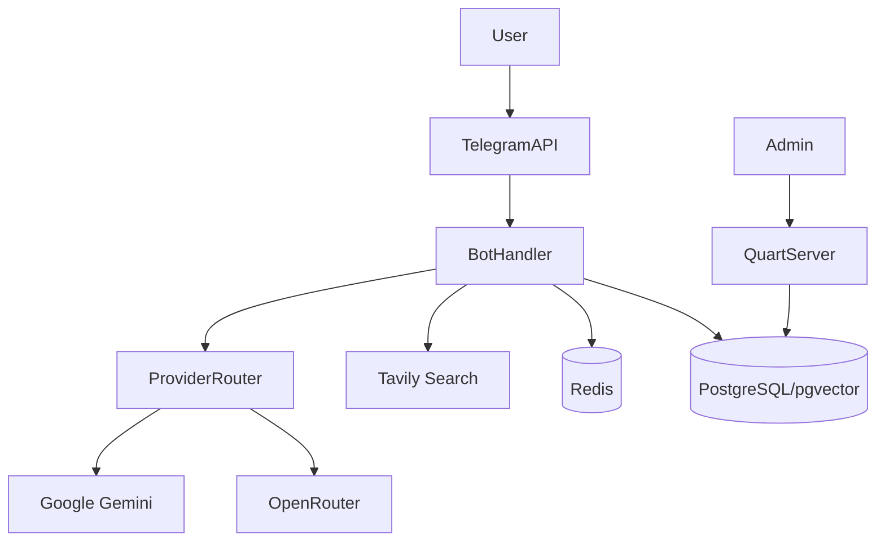

# GemAI Bot v2

An advanced, asynchronous Telegram bot designed as a comprehensive AI assistant. It orchestrates multiple AI providers (Google Gemini, OpenRouter), performs web research via Tavily, maintains long-term contextual memory, and analyzes documents.

## What It Does

The bot provides intelligent conversational abilities within Telegram, augmenting standard LLM replies with real-time internet search capabilities and document processing (PDF, DOCX). It actively manages AI API quotas using a key rotation system, stores chat histories and extracted semantic concepts in a PostgreSQL database, and exposes an administrative health dashboard.

## Current Status

**Production-Ready**. The application uses industry-standard libraries (Quart, asyncpg, python-telegram-bot v20+) and supports Docker deployments with built-in telemetry, circuit breakers, and connection pooling. All critical concurrency limitations and shutdown bottlenecks have been recently stabilized for safe horizontal scaling.

## Features

- **Smart Provider Routing**: Automatic failover and API key rotation across Google Gemini (3.0-flash, 3.1-flash-lite, 2.5-flash, 2.5-flash-lite) and OpenRouter models.
- **Agentic Web Browsing**: Deep research mode utilizing Tavily API and Jina Reader API for multi-step query decomposition, autonomous site triage, content extraction, and dynamic self-correction loops. Hardened against memory leaks caused by gRPC protobuf cyclic references during long-running iterations. Per-call API key usage tracking ensures accurate quota accounting across all LLM invocations within the agentic loop.
- **Image Processing Pipeline**: Context-aware adaptive resize (`TASK_DIMS`: describe 1280px, search 768px, OCR 2048px) with 3-stage compression (thumbnail → JPEG q85 → fallback q75/65), TTL-cached results (`cache_key` by `file_unique_id`), and `TaggedImage` metadata carrier across handler→provider boundary to eliminate redundant recompression. Media group downloads use `Semaphore(5)` with debounced progress indicator.
- **Document Understanding**: Extracts text from PDF/DOCX files and uses it for context-aware Q&A.
- **Persistent Long-Term Memory**: Uses `pgvector` (`halfvec(3072)`) for semantic search and conversational recall. User-toggleable via `/settings`; transparent `🧠` indicator when memories influence a response.
- **Distributed Concurrency**: Multi-tier Redis-backed global semaphores (heavy and ultra-heavy limits) to prevent API quota starvation in multi-replica deployments while guaranteeing isolation between standard queries and intensive Agentic research loops.
- **Resilient Operations**: Instance-based background task manager with exponential backoff, bare-coroutine safety guard, and admin alerting hooks. Atomic metrics persistence with delta-based increments prevents data loss on restart. Prompt registry validates required variables at render time to prevent silent placeholder leaks.
- **Thinking Level Control**: Configurable reasoning depth for supported models.
- **Context Summarization**: Automatic token compression for large chats.
- **Administrative Dashboard**: Quart-based web server serving Prometheus metrics (`/metrics`) and system health overviews.
- **Security & GDPR**: CSRF-protected dashboard authentication, brute-force rate limiting (60 req/min/IP on all API endpoints), API key masking in status endpoints, and Telegram commands for data export (`/mydata`) and deletion (`/deleteme`).

## Non-Goals / Limitations

- **No Voice/Audio Support**: Does not currently process or transcribe Telegram voice messages.
- **OpenRouter Limitations**: Multimodal detection (images) strictly forces Gemini; OpenRouter is not utilized for vision tasks.
- **Local Rate Limits**: Heavy request limits are rigidly enforced per user to prevent API quota drain (`MAX_CONCURRENT_HEAVY_REQUESTS`).
- **Incomplete Schema Bootstrapping**: The codebase relies on historical SQL migration scripts (`scripts/migrations`) for full database schema setups; `app/db/schema.py` alone may be insufficient to build all tables from scratch.

## Architecture

- **Monolithic Container**: A single async event loop runs both the Telegram long-polling (or webhook) updater and the Quart web server via Hypercorn.
- **Database (PostgreSQL)**: Source of truth for users, chats, messages, metrics, roles, and pgvector embeddings.
- **Cache (Redis)**: Optional high-speed layer for caching rate limits and transient states.
- **Third-Party APIs**: Google Gemini (native SDK), OpenRouter (HTTPX), Tavily (HTTPX), Telegram Bot API (HTTPX-based `python-telegram-bot`).



## Repository Structure

| Path                  | Purpose                                                                        |
| --------------------- | ------------------------------------------------------------------------------ |
| `app/`                | Core application logic (bot, web server, DB layer, handlers).                  |
| `app/handlers/`       | Telegram command and message processors (`ai_chat`, `ai_search`, `commands`).  |
| `app/repos/`          | Database repository pattern implementations (queries for chats, memory, keys). |
| `app/templates/`      | HTML Jinja2 templates for the admin web dashboard.                             |
| `docs/`               | Extended architectural documentation.                                          |
| `scripts/migrations/` | Numbered SQL migration files for Database updates.                             |
| `tests/`              | Comprehensive test suite (Unit and Integration).                               |
| `bot.py`              | Main application entry point uniting Quart and the Telegram updater.           |

## Tech Stack

| Layer           | Technology            | Purpose                                        |
| --------------- | --------------------- | ---------------------------------------------- |
| Runtime         | Python 3.14-slim      | Execution environment                          |
| Bot Framework   | `python-telegram-bot` | Async interaction with Telegram APIs           |
| Web Server      | Quart + Hypercorn     | Lightweight dashboard & Prometheus `/metrics`  |
| Database        | `asyncpg`             | High-performance Async PostgreSQL driver       |
| Vector DB       | `pgvector`            | Storing and querying semantic memories         |
| Data Validation | `pydantic`            | Configuration and strictly-typed object models |

## Setup

1. Clone the repository.
2. Ensure Python 3.14-slim and PostgreSQL (with `pgvector` extension) are installed.
3. Install dependencies:
   ```bash
   pip install -r requirements.txt
   ```
4. Copy `.env.example` to `.env` (if applicable) and fill in necessary configuration.
5. Create PostgreSQL database and apply schemas using DDL scripts in `scripts/migrations/`.

## Configuration

All configuration variables are loaded from the environment (or a `.env` file).

| Variable                            | Required | Default                       | Description                                                        | Used In                            |
| ----------------------------------- | -------- | ----------------------------- | ------------------------------------------------------------------ | ---------------------------------- |
| `TELEGRAM_BOT_TOKEN`                | ✅       | -                             | Your Telegram bot API token.                                       | `config.py`, `bot.py`              |
| `DATABASE_URL`                      | ✅       | -                             | Postgres connection string (must support pgvector).                | `config.py`, `database.py`         |
| `ADMIN_ID`                          | ✅       | -                             | Telegram User ID of the bot administrator.                         | `config.py`, Handlers              |
| `JINA_API_KEY`                      | ❌       | -                             | API key for Jina Reader API (web content extraction).              | `config.py`, `web_reader.py`       |
| `AGENTIC_MAX_ITERATIONS`            | ❌       | 3                             | Maximum number of research loop iterations for the agent.          | `config.py`, `agentic.py`          |
| `AGENTIC_MAX_PAGES`                 | ❌       | 3                             | Maximum number of pages to read per iteration.                     | `config.py`, `agentic.py`          |
| `AGENTIC_MODEL`                     | ❌       | `gemini-2.5-flash`              | Recommended reasoning model to use for the agentic loop.           | `config.py`, `agentic.py`          |
| `ADMIN_SECRET`                      | ❌       | -                             | Secret for Dashboard auth and key encryption.                      | `config.py`, `web.py`, `crypto.py` |
| `PORT`                              | ❌       | `10000`                       | Port for the Quart Web Server to bind to.                          | `config.py`, `bot.py`              |
| `ENABLE_WEB_SERVER`                 | ❌       | `true`                        | Enables the built-in diagnostic dashboard.                         | `config.py`, `bot.py`              |
| `GEMINI_API_KEYS`                   | ✅       | -                             | Comma-separated Google access keys.                                | `config.py`                        |
| `TAVILY_API_KEYS`                   | ✅       | -                             | Comma-separated Tavily access keys.                                | `config.py`                        |
| `OPENROUTER_API_KEYS`               | ❌       | `[]`                          | Comma-separated OpenRouter access keys.                            | `config.py`                        |
| `WEBHOOK_URL`                       | ❌       | -                             | Public URL for Telegram Webhook mode. If empty, uses Long-Polling. | `bot.py`                           |
| `STRUCTURED_LOGGING` / `LOG_FORMAT` | ❌       | Auto                          | Enables JSON-structured application logs.                          | `bot.py`                           |
| `DEFAULT_MODEL` / `QNA_MODEL` / ... | ❌       | `gemini-2.5-flash` etc.       | Default Gemini models for specific operations. Supported: `3.0-flash`, `3.1-flash-lite`, `2.5-flash`, `2.5-flash-lite`. | `config.py`                        |
| `OPENROUTER_DEFAULT_MODEL` / ...    | ❌       | `stepfun/step-3.5-flash:free` | Default OpenRouter models for operations.                          | `config.py`                        |
| `DAILY_LIMITS`                      | ❌       | Default dict                  | JSON or compact `model:limit` format for daily rate limits.        | `config.py`                        |
| `USE_OPENROUTER`                    | ❌       | `false`                       | Force OpenRouter as the default provider instead of Gemini.        | `config.py`                        |
| `MAX_CONCURRENT_HEAVY_CALLBACKS`    | ❌       | `4`                           | Max parallel inline button UI callbacks to prevent DB starvation.  | `callbacks.py`                     |
| `MAX_CONCURRENT_HEAVY_REQUESTS`     | ❌       | `4`                           | Max parallel normal AI request handlers to prevent exhaustion.     | `config.py`                        |
| `MAX_CONCURRENT_ULTRA_HEAVY_REQUESTS` | ❌       | `1`                           | Max parallel isolated ultra-heavy tasks (e.g., Agentic Research).  | `config.py`                        |

## Run

**Local Python:**

```bash
python bot.py
```

**Docker Container:**

```bash
./start.sh
# OR via docker-compose:
docker-compose -f docker-compose.northflank.yml up -d
```

## Scripts

| Command                    | Purpose                                  |
| -------------------------- | ---------------------------------------- |
| `ruff check app/`          | Runs Pyflakes / Style / Bugbear linting. |
| `ruff format --check app/` | Verifies code formatting.                |
| `mypy app/`                | Static type checking for Python types.   |

## Testing

The application features a heavily engineered test suite (**1259+ unit and integration tests, 60% line coverage**) with **parallel execution** via `pytest-xdist`.

- **Types:** Unit tests (mocked limits/APIs), Integration tests (raw DB connections via `@pytest.mark.integration`), E2E tests.
- **Dependencies:** `pytest`, `pytest-asyncio`, `pytest-xdist`, `pytest-cov`.
- **Prerequisites:** Integration tests require `TEST_DATABASE_URL` (or `DATABASE_URL` in test environments) to a clean Postgres instance.
- **Default behavior:** Running `pytest` automatically uses parallel workers (`-n auto`) via `pytest.ini` defaults and runs **all** tests (unit + integration).

| Test Type            | Command                               | Scope                                |
| -------------------- | ------------------------------------- | ------------------------------------ |
| Unit (default, fast) | `pytest`                              | Pure logic, LLM mock chains, prompts |
| Integration (slow)   | `pytest -m integration`               | Raw PostgreSQL operations, DB states |
| All tests            | `pytest -m ""`                        | Full suite (unit + integration)      |
| Coverage             | `pytest --cov=app --cov-report=term-missing` | Application-wide execution coverage  |

## API / Events / Contracts

**Telegram Commands:**

**Telegram Commands:**

- **User Commands:**
  - `/start`, `/help` — Initial onboarding & main menus.
  - `/newchat` — Reset context and start a fresh conversation.
  - `/model` — Select the active AI model.
  - `/thinking` — Configure reasoning depth (Auto/Low/Medium/High).
  - `/res` — Toggle Deep Research mode (Tavily-powered).
  - `/settings` — Quick access menu for models, search, and memory toggles.
  - `/stats` — Personal usage metrics, streaks, and API usage stats.
  - `/documents` — Manage and query uploaded PDF/DOCX files.
  - `/roles` — Switch between different AI personas/roles.
  - `/setprompt` — Set a custom system instruction for the current chat.
  - `/save`, `/conversations`, `/switch`, `/rename`, `/delete` — Advanced conversation management (persistence).
  - `/export` — Export the current chat history.
  - `/clearmemory` — Wipe all long-term vector-indexed memories.
  - `/mydata`, `/deleteme` — GDPR compliant data export and account deletion.

- **Admin Commands (Requires `ADMIN_ID`):**
  - `/admin` — Central administration hub.
  - `/listmodels`, `/listusers` — List configured models and registered users.
  - `/adduser`, `/deluser` — Manual user management.
  - `/metrics`, `/rolemetrics` — Detailed system and role-based usage telemetry.
  - `/cachestats`, `/queuestats`, `/docstats`, `/groupstats` — Performance monitoring for different subsystems.
  - `/clearcache`, `/clearoldmetrics`, `/clearolddocs` — System maintenance and cleanup.
  - `/updatetavilykeys`, `/checktavilykeys` — Hot-swap and verify search API keys.
  - `/registergroup` — Authorize the bot for use in a specific Telegram group.
  - `/reloadconfig` — Trigger an immediate hot-reload of the environment configuration.

**Web Dashboard (Quart HTTP Routes):**

- `GET /`, `GET /login`, `POST /login`, `GET /logout` — UI interface (requires `ADMIN_SECRET` authentication and uses Cookie Sessions).
- `GET /health` — Robust unauthenticated API health check.
- `GET /metrics` — Exposes Prometheus telemetry text (uptime, errors, usage).
- `GET /api/overview`, `/api/keys`, `/api/errors`, `/api/cache`, `/api/queue`, `/api/database`, `/api/circuit-breakers`, `/api/memory` — Internal JSON data endpoints for dashboard charts (requires auth cookie or `X-Auth-Token` header).

## Main User Flows

- **Standard Conversation**
  - _Preconditions_: User selects `/newchat`.
  - _Steps_: User inputs text. The orchestrator embeds it in context, pulls long-term memory via pgvector, and dispatches it to the current AI provider model (Gemini or OpenRouter).
  - _Expected Outcome_: Streaming response appended to the Telegram message.
- **Research Query**
  - _Preconditions_: User triggers Research via `/res`.
  - _Steps_: Bot extracts search intent, retrieves context via Tavily API, scores endpoints utilizing LLM, and synthesizes the finalized context stream.
  - _Expected Outcome_: Sourced and cited comprehensive answer.
- **Admin Dashboard Monitoring**
  - _Preconditions_: Application binds to `PORT`, `ENABLE_WEB_SERVER=true`.
  - _Steps_: Admin visits web URL, completes the Brute-force protected Login Flow using the `ADMIN_SECRET` token.
  - _Expected Outcome_: Live monitoring of metrics, keys usage, memory efficiency, and database connection pools.

## Troubleshooting

- **Conflict Error on Startup**: Usually signifies another bot instance is currently polling the Telegram API using the same Token. Requires closing duplicate instances if not using Webhooks.
- **`decryption_error` traces**: Usually caused by attempting to load the database on a new host without providing the exact prior base64 `ADMIN_SECRET`.
- **Search features hanging**: Check `TAVILY_API_KEYS` exhaustively or verify the `circuit_breaker` state at `/api/circuit-breakers`.

## Known Documentation Gaps

- **Code/Schema Mismatch**: The repository utilizes `app/db/schema.py` for initial creation, but completely depends on `scripts/migrations/` DDL logic (e.g., `008_upgrade_embedding_3072.sql`) to instantiate `long_term_memory` structures and `pgvector` sizing. Attempting to deploy _only_ via `schema.py` natively will crash memory pipelines since the database tables rely on historical manual patch migration scripts.
- **Bot Config vs Environment Discrepancy**: Northflank compose config explicitly enables `LOG_JSON=true`, however, runtime application checks environment variable `STRUCTURED_LOGGING` and `LOG_FORMAT` in `bot.py`.
- **OpenRouter Multimodal Capabilities**: OpenRouter is explicitly disabled for multimodality interactions in current abstractions; however, this architecture distinction is under-represented in internal application documentation.

## Contributing

1. Create a descriptive PR.
2. Verify all `pytest` checks pass (`pytest` for unit tests, `pytest -m ""` for full suite).
3. Verify `ruff check app/` yields zero stylistic flags and `mypy app/` validates static types before submission.

## License

MIT (Verified via shield badge notation in legacy files).
