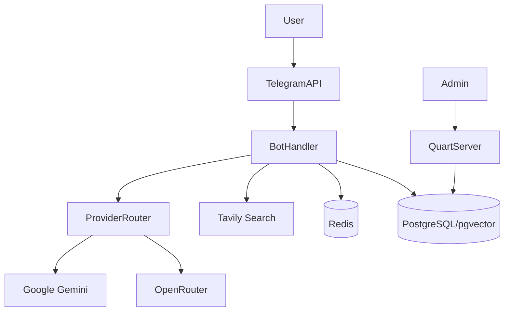

# GemAI Bot v2

An advanced, asynchronous Telegram bot designed as a comprehensive AI assistant. It orchestrates multiple AI providers (Google Gemini, OpenRouter), performs web research via native Google Search Grounding and Tavily, maintains long-term contextual memory, and processes multimodal inputs (voice, images, documents).

## What It Does

The bot provides intelligent conversational abilities within Telegram, augmenting standard LLM replies with real-time internet search capabilities and multimodal processing (voice transcription, image analysis, PDF/DOCX). It actively manages AI API quotas using a key rotation system with automatic 503/UNAVAILABLE key rotation, stores chat histories and extracted semantic concepts in a PostgreSQL database, and exposes an administrative health dashboard.

## Current Status

**Production-Ready**. The application uses industry-standard libraries (Quart, asyncpg, python-telegram-bot[job-queue] v20+) and supports Docker deployments with built-in telemetry, circuit breakers, and connection pooling. All critical concurrency limitations and shutdown bottlenecks have been recently stabilized for safe horizontal scaling.

## Features

- **Smart Provider Routing**: Automatic failover and API key rotation across Google Gemini (3.0-flash, 3.1-flash-lite, 2.5-flash, 2.5-flash-lite) and OpenRouter models.
- **Quick Search (`?` prefix)**: Single-call web search using **native Google Search Grounding** — the LLM queries the web internally, eliminating extra network hops. Uses a resilient model fallback chain (`gemini-3.1-flash-lite-preview` → `gemini-2.5-flash-lite`) for low latency.
- **Agentic Web Browsing (`??` prefix)**: Deep research mode utilizing Tavily API and Jina Reader API for multi-step query decomposition, autonomous site triage, content extraction, and dynamic self-correction loops. Hardened against memory leaks caused by gRPC protobuf cyclic references during long-running iterations (including threaded, non-blocking asynchronous Garbage Collection). Per-call API key usage tracking ensures accurate quota accounting across all LLM invocations within the agentic loop. Features an intelligent **Model Fallback Cascade** (automatically retries failed LLM requests or 503 errors using the next most capable model according to the capability tier rankings), parallel tool execution (`asyncio.gather` with semaphore), two-layer page content caching (session + global, 30-min TTL), source quality scoring (domain classification, freshness labels, citation validation), adaptive iteration budget (query deduplication, configurable token cap and wall-clock timeout), and rich streaming progress with search queries and iteration counters.
- **Image Processing Pipeline**: Context-aware adaptive resize (`TASK_DIMS`: describe 1280px, search 768px, OCR 2048px) governed by **Shannon Entropy Analysis** (dynamically boosts +50% dimension for text-dense screenshots while reducing -25% for simple photos, optimizing token usage). Uses a 3-stage compression pipeline (thumbnail → JPEG q85 → fallback q75/65), TTL-cached results (`cache_key` by `file_unique_id`), and `TaggedImage` metadata carrier across handler→provider boundary to eliminate redundant recompression. Media group downloads use `Semaphore(5)` with debounced progress indicator.
- **Document Understanding**: Extracts text from PDF/DOCX files and uses it for context-aware Q&A.
- **Multimodal Processing Pipeline**: Voice messages transcribed via `gemini-3.1-flash-lite` (high thinking budget for ASR quality) with intent-aware routing (`INTENT:CONVERSATIONAL`, `INTENT:TRANSCRIPTION`, `INTENT:SEARCH`). Features **Smart Voice Auto-Routing** (bypasses manual confirmation UI for low-complexity transcripts) with regex-based fluff tolerance, **Agentic Voice Search** (detects search intent to natively trigger the web research engine), and **Show & Tell** (voice-replies to photos dynamically inject the image into the LLM context). Hardened against ASR instruction-following bleed (where transcribe prompts attempt to answer questions). The **Voice Engine 2.0** pipeline powers outbound automatic voice replies using the **Gemini Live API** (`gemini-3.1-flash-live-preview`, manual VAD with `activityStart`/`activityEnd` for one-shot text-to-speech) as the primary provider, with REST TTS (`gemini-2.5-flash-preview-tts`, structured **Director's Notes** prompt with pronunciation intelligence for correct ё/е diacritics and stress) as a reliable fallback. Audio is transcoded into Telegram-compliant PCM→OGG Opus via `ffmpeg`. Users can hit the **Re-transcribe (Flash)** button to retry stubborn transcription with a heavier model (`gemini-3-flash-preview`). Includes a hidden developer command (`/asr <model>`) via Reply context for rapid AB testing of ASR model hallucination rates. Pipeline is hardened against silent timeouts, features **synchronous double-tap rejection** via atomic `is_processing` locks, and safely isolates conversational context to specific `message_id`s. Images analyzed with adaptive vision prompts, documents chunked with query-aware relevance scoring. All media types stored as long-term memories via background `submit_retryable()` tasks. Resilient API key rotation on 503/UNAVAILABLE errors and quota exhaustion (e.g., TTS 10 RPD / 3 RPM caps) dynamically spins up backup keys inside the `ProviderRouter`.
- **Internationalization (i18n)**: Content-based language detection (Cyrillic density heuristic) with full bilingual UI (Russian/English). All user-facing strings externalized to `app/i18n.py` registry with `t(key, lang, **kwargs)` lookup. Language detected from message content, not Telegram settings.
- **Persistent GraphRAG Memory**: Semantic recall via `pgvector` (`halfvec(768)`) with hybrid RRF retrieval (cosine similarity + `pg_trgm` keyword matching) and **1-hop Knowledge Graph Traversal**. Voice and media memories are **Enriched with Modality/Tone Tags** (e.g., `[VOICE, Tone: X]`) via dedicated system prompts to dramatically improve semantic routing. System clusters relational knowledge into dual tables (`memory_nodes`, `memory_edges`) for entity graphing. Memories injected into `system_instruction` as structured `<long_term_memory><fact>` XML tags (Context Engineering). Only user intent is embedded for maximum vector density (`source_type='user_intent'`). Dynamic consolidation triggers at ~8,000 tokens or 7 days, extracting atomic persona facts and relationships via LLM. User-manageable via `/memory` (paginated inline UI with per-item delete) and toggleable via `/settings`.
- **Distributed Concurrency**: Multi-tier Redis-backed global semaphores (heavy and ultra-heavy limits) to prevent API quota starvation in multi-replica deployments while guaranteeing isolation between standard queries and intensive Agentic research loops.
- **Resilient Operations**: Instance-based background task manager with exponential backoff, bare-coroutine safety guard, and admin alerting hooks. Atomic metrics persistence with delta-based increments prevents data loss on restart. Prompt registry validates required variables at render time to prevent silent placeholder leaks.
- **Thinking Level Control**: Configurable reasoning depth for supported models.
- **Adaptive Thinking Budget**: Automatic `thinking_level` selection via 14 regex heuristics + context-aware escalation. Simple greetings get `low`, code/math/multi-step queries get `high`. User explicit preference always overrides.
- **Conversation Branching**: Fork current chat into a "what-if" branch via snapshot. Explore alternative conversation paths without losing the main thread. One-click restore to the original context.
- **Smart Context Window**: Model-specific token budgets (flash-lite: 32K, flash: 128K — evidence-based on context degradation research) with automatic context trimming and LLM-backed summarization of dropped history.
- **Agentic Smart Reminders**: DB-persisted user reminders (`/remind 30m Check logs`) with 60s poll-based delivery via `job_queue`. Supports **Zero-Latency Intent Classification** (automatically detects whether a prompt requires a simple text notification, quick QnA search, or deep agentic research). AI tasks run in non-blocking background tasks (`asyncio.create_task`) with concurrency semaphores (max 3), 5-minute timeout guards, and inline ❌ cancel buttons in the reminder list.
- **Context Summarization**: Automatic token compression for large chats via `app/context/` subsystem — `ContextAssembler` orchestrates history assembly within model-specific token budgets, `Summarizer` produces LLM-backed compressed summaries, and `TokenBudget` maps model patterns to limits (flash-lite: 32K, flash: 128K).
- **Document Chunking**: Retrieval-time chunking (`app/documents/chunking.py`) with three strategies — recursive (paragraph/sentence/word), hierarchical (parent/child), and query-aware relevance scoring (`chunk_for_context`) — replacing naïve hard-truncation.
- **Intelligence Briefs**: DB-persisted topic subscriptions (`/subscribe`, `/unsubscribe`). Hourly job extracts topics from LTM → Tavily search → Gemini summary → Telegram delivery. Backed by `brief_subscriptions` table with RLS.
- **Administrative Dashboard**: Quart-based web server serving Prometheus metrics (`/metrics`), system health overviews, batch API (`/api/dashboard` — 8 metrics in 1 RTT), SSE live updates (`/api/events` — 5s real-time stream), and key health diagnostics (`/api/key-health`). Frontend integrates SSE EventSource for real-time CPU/memory/queue updates between polls.
- **Request Deduplication & Debouncing**: In-memory double-tap prevention middleware with 3s window and MD5 hashing blocks duplicate identical requests. Rapid-fire text messages (split-tapping) are handled by a **400ms Message Debounce** aggregation window, merging multiple fragments into a single AI request to prevent token waste and fragmented replies.
- **Key Rotation Observability**: Structured `KEY_EVENT` logging for usage milestones, near-limit warnings (70%), threshold rotations, and a `get_health_summary()` dashboard API with per-key status snapshots.
- **Structured Error Classification**: O(1) type-based error classification via `ErrorCode` enum (17 exception types + 8 HTTP status codes), replacing fragile emoji/text pattern matching. Full error-to-user-message mapping.
- **Graceful Shutdown**: Two-phase drain (pending state persists + task queue) before resource cleanup, preventing data loss during deploys.
- **Streaming Reliability**: Exponential backoff retry (0.5→1→2s + jitter) for Telegram rate-limit errors with adaptive debounce escalation (auto-scales up to 3s).
- **Security & GDPR**: CSRF-protected dashboard authentication, brute-force rate limiting (60 req/min/IP on all API endpoints), API key masking in status endpoints, and Telegram commands for data export (`/mydata`) and deletion (`/deleteme`).

## Non-Goals / Limitations

- **Voice Processing Limitations**: Voice transcription uses `gemini-3.1-flash-lite` — quality depends on audio clarity and language support of the underlying model. Conversational voice flow requires user confirmation before AI processing.
- **OpenRouter Limitations**: Multimodal detection (images) strictly forces Gemini; OpenRouter is not utilized for vision tasks.
- **Local Rate Limits**: Heavy request limits are rigidly enforced per user to prevent API quota drain (`MAX_CONCURRENT_HEAVY_REQUESTS`).
- **No ORM**: Raw SQL via asyncpg; no SQLAlchemy or Alembic.

## Architecture

- **Monolithic Container**: A single async event loop runs both the Telegram long-polling (or webhook) updater and the Quart web server via Hypercorn.
- **Database (PostgreSQL)**: Source of truth for users, chats, messages, metrics, roles, and pgvector embeddings.
- **Cache (Redis)**: Optional high-speed layer for caching rate limits and transient states.
- **Third-Party APIs**: Google Gemini (native SDK), OpenRouter (HTTPX), Tavily (HTTPX), Telegram Bot API (HTTPX-based `python-telegram-bot`).



## Repository Structure

| Path                  | Purpose                                                                        |
| --------------------- | ------------------------------------------------------------------------------ |
| `app/`                | Core application logic (bot, web server, DB layer, handlers).                  |
| `app/handlers/`       | Telegram command and message processors (`ai_chat`, `ai_search`, `commands`).  |
| `app/repos/`          | Database repository pattern implementations (queries for chats, memory, keys). |
| `app/providers/`      | AI provider abstraction layer (base, Gemini, OpenRouter, router).              |
| `app/core/`           | Agentic research engine — multi-step query decomposition and tool use.         |
| `app/context/`        | Context assembly subsystem (assembler, summarizer, token budget).              |
| `app/documents/`      | Document processing: chunking strategies, parsers, document repository.        |
| `app/middleware/`     | Request pipeline middleware (dedup).                                           |
| `app/adapters/`       | Concurrency primitives and Telegram UI adapter.                                |
| `app/db/`             | Database bootstrap: schema validation, migrations runner, RLS, seed.           |
| `app/utils/`          | Shared utilities (formatting, keyboards, background tasks, image utils, etc.). |
| `app/templates/`      | HTML Jinja2 templates for the admin web dashboard.                             |
| `docs/`               | Extended architectural documentation.                                          |
| `scripts/migrations/` | Numbered SQL migration files — single source of truth for all DDL.             |
| `tests/`              | Comprehensive test suite (Unit and Integration).                               |
| `bot.py`              | Main application entry point uniting Quart and the Telegram updater.           |

## Tech Stack

| Layer           | Technology            | Purpose                                        |
| --------------- | --------------------- | ---------------------------------------------- |
| Runtime         | Python 3.14-slim      | Execution environment                          |
| Bot Framework   | `python-telegram-bot` | Async interaction with Telegram APIs           |
| Web Server      | Quart + Hypercorn     | Lightweight dashboard & Prometheus `/metrics`  |
| Database        | `asyncpg`             | High-performance Async PostgreSQL driver       |
| Vector DB       | `pgvector`            | Storing and querying semantic memories         |
| Data Validation | `pydantic`            | Configuration and strictly-typed object models |

## Setup

1. Clone the repository.
2. Ensure Python 3.14-slim and PostgreSQL (with `pgvector` extension) are installed.
3. Install dependencies:
   ```bash
   pip install -r requirements.txt
   ```
4. Copy `.env.example` to `.env` (if applicable) and fill in necessary configuration.
5. Create PostgreSQL database with `pgvector` extension. Schema is applied automatically on first startup via `scripts/migrations/`.

## Configuration

All configuration variables are loaded from the environment (or a `.env` file).

| Variable                            | Required | Default                       | Description                                                        | Used In                            |
| ----------------------------------- | -------- | ----------------------------- | ------------------------------------------------------------------ | ---------------------------------- |
| `TELEGRAM_BOT_TOKEN`                | ✅       | -                             | Your Telegram bot API token.                                       | `config.py`, `bot.py`              |
| `DATABASE_URL`                      | ✅       | -                             | Postgres connection string (must support pgvector).                | `config.py`, `database.py`         |
| `ADMIN_ID`                          | ✅       | -                             | Telegram User ID of the bot administrator.                         | `config.py`, Handlers              |
| `JINA_API_KEY`                      | ❌       | -                             | API key for Jina Reader API (web content extraction).              | `config.py`, `web_reader.py`       |
| `AGENTIC_MAX_ITERATIONS`            | ❌       | 3                             | Maximum number of research loop iterations for the agent.          | `config.py`, `agentic.py`          |
| `AGENTIC_MAX_PAGES`                 | ❌       | 3                             | Maximum number of pages to read per iteration.                     | `config.py`, `agentic.py`          |
| `AGENTIC_MAX_TOKENS`                | ❌       | `100000`                      | Token budget cap for the entire agentic research session.          | `config.py`, `agentic.py`          |
| `AGENTIC_TIMEOUT_SECONDS`           | ❌       | `90`                          | Wall-clock timeout (seconds) for the agentic research loop.        | `config.py`, `agentic.py`          |
| `AGENTIC_MODEL`                     | ❌       | `gemini-2.5-flash`              | Recommended reasoning model to use for the agentic loop.           | `config.py`, `agentic.py`          |
| `ADMIN_SECRET`                      | ❌       | -                             | Secret for Dashboard auth and key encryption.                      | `config.py`, `web.py`, `crypto.py` |
| `PORT`                              | ❌       | `10000`                       | Port for the Quart Web Server to bind to.                          | `config.py`, `bot.py`              |
| `ENABLE_WEB_SERVER`                 | ❌       | `true`                        | Enables the built-in diagnostic dashboard.                         | `config.py`, `bot.py`              |
| `GEMINI_API_KEYS`                   | ✅       | -                             | Comma-separated Google access keys.                                | `config.py`                        |
| `TAVILY_API_KEYS`                   | ✅       | -                             | Comma-separated Tavily access keys.                                | `config.py`                        |
| `OPENROUTER_API_KEYS`               | ❌       | `[]`                          | Comma-separated OpenRouter access keys.                            | `config.py`                        |
| `WEBHOOK_URL`                       | ❌       | -                             | Public URL for Telegram Webhook mode. If empty, uses Long-Polling. | `bot.py`                           |
| `STRUCTURED_LOGGING` / `LOG_FORMAT` | ❌       | Auto                          | Enables JSON-structured application logs.                          | `bot.py`                           |
| `DEFAULT_MODEL` / `QNA_MODEL` / ... | ❌       | `gemini-2.5-flash` etc.       | Default Gemini models for specific operations. Supported: `3.0-flash`, `3.1-flash-lite`, `2.5-flash`, `2.5-flash-lite`. | `config.py`                        |
| `OPENROUTER_DEFAULT_MODEL` / ...    | ❌       | `stepfun/step-3.5-flash:free` | Default OpenRouter models for operations.                          | `config.py`                        |
| `DAILY_LIMITS`                      | ❌       | Default dict                  | JSON or compact `model:limit` format for daily rate limits.        | `config.py`                        |
| `USE_OPENROUTER`                    | ❌       | `false`                       | Force OpenRouter as the default provider instead of Gemini.        | `config.py`                        |
| `MAX_CONCURRENT_HEAVY_CALLBACKS`    | ❌       | `4`                           | Max parallel inline button UI callbacks to prevent DB starvation.  | `callbacks.py`                     |
| `MAX_CONCURRENT_HEAVY_REQUESTS`     | ❌       | `4`                           | Max parallel normal AI request handlers to prevent exhaustion.     | `config.py`                        |
| `MAX_CONCURRENT_ULTRA_HEAVY_REQUESTS` | ❌       | `1`                           | Max parallel isolated ultra-heavy tasks (e.g., Agentic Research).  | `config.py`                        |
| `LRU_STATE_CACHE_SIZE`              | ❌       | `1000`                        | Max entries in the in-memory user state cache (prevents OOM crashes). | `config.py`, `state.py`            |

## Run

**Local Python:**

```bash
python bot.py
```

**Docker Container:**

```bash
./start.sh
# OR via docker-compose:
docker-compose -f docker-compose.northflank.yml up -d
```

## Schema Management

All database DDL is managed via **numbered SQL migration files** in `scripts/migrations/`.

| Component | Role |
|---|---|
| `scripts/migrations/000_init_schema.sql` | Complete table definitions (24 tables) — the full bootstrap DDL |
| `scripts/migrations/001-019_*.sql` | Incremental schema changes (ALTER, indexes, RLS, triggers, cleanup) |
| `scripts/migrations/020_add_trgm_hybrid_search.sql` | Enables `pg_trgm` extension + GIN index for hybrid keyword+semantic memory search |
| `scripts/migrations/018_add_missing_table_definitions.sql` | Backfill migration for databases that applied `000` without all tables |
| `app/db/migrations.py` | Migration runner — applies SQL files with version tracking (`schema_migrations` table) |
| `app/db/schema.py` | Startup validation — verifies all expected tables exist after migrations |
| `app/db/rls.py` | Row Level Security policy management |
| `app/db/seed.py` | Initial data seeding (admin user, API keys, indexes) |

**Workflow:** On startup, `init_db()` → `create_tables()` (validation) → `setup_row_level_security()` → `run_migrations()` → `insert_initial_data()`.

**Adding new tables:** Create a new numbered `.sql` file in `scripts/migrations/`, add the table name to `EXPECTED_TABLES` in `app/db/schema.py`, and add RLS configuration to `app/db/rls.py` if needed.

## Long-Term Memory Architecture

Persistent semantic recall stored in the `long_term_memory` table (`pgvector` `halfvec(768)`).

| Parameter | Value | Config Location |
|-----------|-------|-----------------|
| Embedding model | `gemini-embedding-2-preview` (768 dims) | `app/repos/memory.py` |
| Max memories per user | 500 | `MAX_MEMORIES_PER_USER` |
| Default TTL | 90 days | `DEFAULT_MEMORY_TTL_DAYS` |
| Min query length (store) | 30 chars | `ai_chat.py` threshold |
| Min query length (recall) | 15 chars | `ai_chat.py` threshold |
| Similarity threshold | 0.72 | `ai_chat.py` `min_similarity` |
| Recall limit | 3 memories | `ai_chat.py` `limit` |

**Storage:** Only user intent is embedded (`user_message[:500]`, `source_type='user_intent'`). Bot replies are discarded to maximize vector density. Saving is asynchronous and non-blocking via `submit_retryable()` with 3 retries.

**Retrieval:** Hybrid Reciprocal Rank Fusion (RRF) combining `pgvector` cosine similarity with `pg_trgm` trigram keyword matching (`k=60` smoothing). Falls back to pure semantic search if `pg_trgm` is not installed. Query embeddings use `task_type='RETRIEVAL_QUERY'`.

**Injection:** Retrieved memories are formatted as XML tags and appended to `system_instruction` (Context Engineering pattern):
```xml
<long_term_memory>
  <fact source="2026-03-20">User prefers Python for backend</fact>
  <fact source="2026-03-18">User works at a fintech startup</fact>
</long_term_memory>
```

**Consolidation:** When raw memories exceed ~8,000 tokens OR 7 days since last consolidation, `gemini-2.0-flash-lite` extracts 5-8 atomic persona facts. Raw memories are deleted and replaced with consolidated facts (`source_type='consolidated'`) in a single transaction.

**Scope:** Memory operates globally — all standard chat messages trigger store/recall when `ltm_enabled=True`. Agentic research (`??`) does not store memories but can recall from them.

**User Control:** `/memory` shows paginated viewer with per-item delete. `/clearmemory` wipes all. `/settings` toggles `ltm_enabled`. `/deleteme CONFIRM` deletes all data including memories (GDPR Art. 17).

**Operational Notes:**
- To manually prune: `DELETE FROM long_term_memory WHERE created_at < now() - interval '180 days'`
- The GIN index `idx_ltm_content_trgm` supports the `%` operator for keyword matching; rebuild with `REINDEX INDEX idx_ltm_content_trgm` if needed
- Monitor memory count per user via `get_memory_stats(user_id)` or the admin dashboard

## Scripts

| Command                    | Purpose                                  |
| -------------------------- | ---------------------------------------- |
| `ruff check app/`          | Runs Pyflakes / Style / Bugbear linting. |
| `ruff format --check app/` | Verifies code formatting.                |
| `mypy app/`                | Static type checking for Python types.   |

## Testing

The application features a heavily engineered test suite (**1453+ unit and integration tests, 60% line coverage**) with **parallel execution** via `pytest-xdist`.

- **Types:** Unit tests (mocked limits/APIs), Integration tests (raw DB connections via `@pytest.mark.integration`), E2E tests.
- **Dependencies:** `pytest`, `pytest-asyncio`, `pytest-xdist`, `pytest-cov`.
- **Prerequisites:** Integration tests require `TEST_DATABASE_URL` (or `DATABASE_URL` in test environments) to a clean Postgres instance.
- **Default behavior:** Running `pytest` automatically uses parallel workers (`-n auto`) via `pytest.ini` defaults and runs **all** tests (unit + integration).

| Test Type            | Command                               | Scope                                |
| -------------------- | ------------------------------------- | ------------------------------------ |
| Unit (default, fast) | `pytest`                              | Pure logic, LLM mock chains, prompts |
| Integration (slow)   | `pytest -m integration`               | Raw PostgreSQL operations, DB states |
| All tests            | `pytest -m ""`                        | Full suite (unit + integration)      |
| Coverage             | `pytest --cov=app --cov-report=term-missing` | Application-wide execution coverage  |

## API / Events / Contracts

**Telegram Commands:**

- **User Commands:**
  - `/start`, `/help` — Initial onboarding & main menus.
  - `/newchat` — Reset context and start a fresh conversation.
  - `/model` — Select the active AI model.
  - `/thinking` — Configure reasoning depth (Auto/Low/Medium/High).
  - `/res` — Toggle Deep Research mode (Tavily-powered).
  - `/settings` — Quick access menu for models, search, and memory toggles.
  - `/stats` — Personal usage metrics, streaks, and API usage stats.
  - `/documents` — Manage and query uploaded PDF/DOCX files.
  - `/roles` — Switch between AI personas/roles. Custom roles support prompt editing (manual replacement or AI-enhanced rewrite with preview and manual tweaking).
  - `/setprompt` — Set a custom system instruction for the current chat.
  - `/save`, `/conversations`, `/switch`, `/rename`, `/delete` — Advanced conversation management (persistence).
  - `/export` — Export the current chat history.
  - `/memory` — Paginated viewer of long-term memories with per-item inline delete.
  - `/clearmemory` — Wipe all long-term vector-indexed memories.
  - `/remind` — Set timed reminders with bilingual time parsing (EN/RU). Supports text, QnA, and agentic AI task delivery.
  - `/subscribe`, `/unsubscribe` — Manage hourly intelligence brief subscriptions (LTM-topic-aware web research summaries).
  - `/mydata`, `/deleteme` — GDPR compliant data export and account deletion.

- **Admin Commands (Requires `ADMIN_ID`):**
  - `/admin` — Central administration hub.
  - `/listmodels`, `/listusers` — List configured models and registered users.
  - `/adduser`, `/deluser` — Manual user management.
  - `/metrics`, `/rolemetrics` — Detailed system and role-based usage telemetry.
  - `/cachestats`, `/queuestats`, `/docstats`, `/groupstats` — Performance monitoring for different subsystems.
  - `/clearcache`, `/clearoldmetrics`, `/clearolddocs` — System maintenance and cleanup.
  - `/updatetavilykeys`, `/checktavilykeys` — Hot-swap and verify search API keys.
  - `/registergroup` — Authorize the bot for use in a specific Telegram group.
  - `/reloadconfig` — Trigger an immediate hot-reload of the environment configuration.

**Web Dashboard (Quart HTTP Routes):**

- `GET /`, `GET /login`, `POST /login`, `GET /logout` — UI interface (requires `ADMIN_SECRET` authentication and uses Cookie Sessions).
- `GET /health` — Robust unauthenticated API health check.
- `GET /metrics` — Exposes Prometheus telemetry text (uptime, errors, usage).
- `GET /api/dashboard` — Aggregated batch endpoint (replaces 8 individual fetches with 1 RTT). Auth required.
- `GET /api/overview`, `/api/keys`, `/api/errors`, `/api/cache`, `/api/queue`, `/api/database`, `/api/circuit-breakers`, `/api/memory` — Individual JSON data endpoints for dashboard charts (requires auth cookie or `X-Auth-Token` header).
- `GET /api/key-health` — Per-key health diagnostics: status, failure count, suspension info. Auth required.
- `GET /api/events` — Server-Sent Events stream (5s interval) for real-time CPU, memory, DB, queue, and request metrics.

## Main User Flows

- **Standard Conversation**
  - _Preconditions_: User selects `/newchat`.
  - _Steps_: User inputs text. The orchestrator embeds it in context, pulls long-term memory via pgvector, and dispatches it to the current AI provider model (Gemini or OpenRouter).
  - _Expected Outcome_: Streaming response appended to the Telegram message.
- **Research Query**
  - _Preconditions_: User triggers Research via `/res`.
  - _Steps_: Bot extracts search intent, retrieves context via Tavily API, scores endpoints utilizing LLM, and synthesizes the finalized context stream.
  - _Expected Outcome_: Sourced and cited comprehensive answer.
- **Admin Dashboard Monitoring**
  - _Preconditions_: Application binds to `PORT`, `ENABLE_WEB_SERVER=true`.
  - _Steps_: Admin visits web URL, completes the Brute-force protected Login Flow using the `ADMIN_SECRET` token.
  - _Expected Outcome_: Live monitoring of metrics, keys usage, memory efficiency, and database connection pools.

## Troubleshooting

- **Conflict Error on Startup**: Usually signifies another bot instance is currently polling the Telegram API using the same Token. Requires closing duplicate instances if not using Webhooks.
- **`decryption_error` traces**: Usually caused by attempting to load the database on a new host without providing the exact prior base64 `ADMIN_SECRET`.
- **Search features hanging**: Check `TAVILY_API_KEYS` exhaustively or verify the `circuit_breaker` state at `/api/circuit-breakers`.

## Known Documentation Gaps

- **Bot Config vs Environment Discrepancy**: Northflank compose config explicitly enables `LOG_JSON=true`, however, runtime application checks environment variable `STRUCTURED_LOGGING` and `LOG_FORMAT` in `bot.py`.
- **OpenRouter Multimodal Capabilities**: OpenRouter is explicitly disabled for multimodality interactions in current abstractions; however, this architecture distinction is under-represented in internal application documentation.

## Future / Roadmap

| Feature | Description | Status |
|---------|-------------|--------|
| **Debate Mode** | Multi-model argument synthesis — the bot queries 2–3 models with opposing viewpoints, then synthesizes a balanced answer highlighting agreements, disagreements, and confidence levels. Ideal for complex or controversial topics. | Planned |
| **Shared Group Brain** | Group-level long-term memory — when the bot is added to a Telegram group, it builds a shared LTM across all group members. Group memories are tagged by contributor and searchable by any member. Includes configurable privacy controls (opt-in/opt-out per user). | Planned |

## Contributing

1. Create a descriptive PR.
2. Verify all `pytest` checks pass (`pytest` for unit tests, `pytest -m ""` for full suite).
3. Verify `ruff check app/` yields zero stylistic flags and `mypy app/` validates static types before submission.

## License

MIT (Verified via shield badge notation in legacy files).
