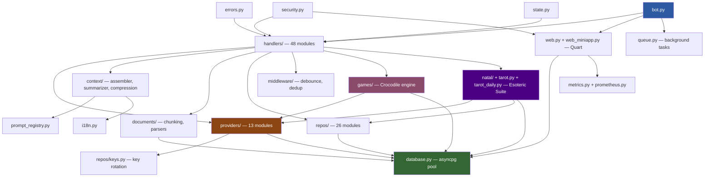

# Architecture Overview — GemAI Bot v2

> **Last updated**: 2026-08-14

## Project Map

```
gemaibotv2/
├── bot.py                        ← Entry point: Telegram PTB + Quart lifecycle (908 LOC)
├── app/
│   ├── config.py                 ← Pydantic Settings, env loading, hot-reload (36KB)
│   │
│   ├── ── AI Layer ──────────────────────────────────────────────
│   ├── providers/                ← Provider abstraction — 13 modules
│   │   ├── __init__.py          ←   Public API re-exports
│   │   ├── base.py              ←   BaseProvider ABC (12KB)
│   │   ├── gemini.py            ←   Google Gemini (native genai SDK, 34KB)
│   │   ├── opencode.py          ←   Opencode Go (HTTPX, 26KB)
│   │   ├── openrouter.py        ←   OpenRouter (HTTPX, multi-model, 20KB)
│   │   ├── freetheai.py         ←   FreeTheAI Router (vhr/cat/yng prefixes, 2KB)
│   │   ├── freetheai_image.py   ←   FreeTheAI Image generation (8KB)
│   │   ├── freetheai_audio.py   ←   FreeTheAI Audio/Lyria (11KB)
│   │   ├── router.py            ←   ProviderRouter — key rotation, health scoring, fallback (46KB)
│   │   ├── imagen_provider.py   ←   Google Imagen 4 image generation (13KB)
│   │   ├── pollinations.py      ←   Pollinations.ai image generation (19KB)
│   │   ├── elevenlabs_tts.py    ←   ElevenLabs TTS (primary voice, 14KB)
│   │   ├── tts.py               ←   Gemini TTS (fallback voice, 13KB)
│   │   ├── stream_types.py      ←   Typed generation request/events and stream invariants
│   │   ├── request_factory.py   ←   JSON history → typed generation boundary
│   │   └── typed_payloads.py    ←   Provider-native payload construction
│   ├── response_delivery/       ← Telegram response ownership boundary
│   │   ├── delivery.py          ←   Handler-facing streamed/completed delivery façade
│   │   ├── coordinator.py       ←   Provider lifecycle and typed outcome coordination
│   │   ├── renderer.py          ←   Progressive edits, Reader/Telegraph/split fallback
│   │   ├── presentation.py      ←   Canonical content and action preparation
│   │   ├── outcomes.py          ←   Immutable delivery outcomes and receipts
│   │   └── normalization.py     ←   Narrow output normalization
│   │
│   ├── ── Agentic Research ──────────────────────────────────────
│   ├── core/
│   │   ├── agentic.py           ←   Multi-step query decomposition, tool use, web browsing (39KB)
│   │   └── entities.py          ←   Research entities / data models (2KB)
│   │
│   ├── ── Context & Prompts ─────────────────────────────────────
│   ├── context/                  ← Token-budget-aware context assembly — 5 modules
│   │   ├── __init__.py          ←   Public API
│   │   ├── assembler.py         ←   ContextAssembler — history assembly + trimming (13KB)
│   │   ├── compression.py       ←   AAAK tiered context compression (12KB)
│   │   ├── summarizer.py        ←   LLM-backed compressed summaries (6KB)
│   │   └── token_budget.py      ←   Model-specific token budgets + dataclasses (2KB)
│   ├── prompt_registry.py       ← Versioned prompt templates, LRU-cached rendering (39KB)
│   ├── i18n.py                  ← Bilingual RU/EN string registry (Cyrillic density detection, 44KB)
│   │
│   ├── ── Document Processing ───────────────────────────────────
│   ├── documents/
│   │   ├── __init__.py          ←   Public API
│   │   ├── chunking.py          ←   Recursive, hierarchical, query-aware chunking (7KB)
│   │   ├── repository.py        ←   Document DB CRUD (11KB)
│   │   └── parsers.py           ←   PDF/DOCX extraction (1KB)
│   │
    ├── ── Handlers (Telegram) ───────────────────────────────────
    ├── handlers/                 ← 48 handler modules, organized by domain:
    │   ├── __init__.py
    │   ├── messages.py          ←   Main message router + debounce integration (37KB)
    │   ├── commands.py          ←   /start, /help, /settings, /model, etc. (32KB)
    │   ├── callbacks.py         ←   Inline keyboard callback dispatcher (16KB)
    │   ├── inline.py            ←   Inline mode — 5-mode smart image routing (78KB)
    │   ├── ai_chat.py           ←   Text → AI with LTM recall (33KB)
    │   ├── ai_core.py           ←   AI response error handling (4KB)
    │   ├── ai_document.py       ←   Document Q&A (11KB)
    │   ├── ai_photo.py          ←   Image analysis (Shannon entropy adaptive resize, 25KB)
    │   ├── ai_search.py         ←   Quick search (Google Grounding) + deep search (27KB)
    │   ├── agent.py             ←   Agentic research handler (9KB)
    │   ├── chat_logic.py        ←   Shared chat processing utilities (5KB)
    │   ├── board_handler.py     ←   Collaborative AI-Notes board handler (16KB)
    │   ├── msg_document.py      ←   Document upload handler (10KB)
    │   ├── msg_media.py         ←   Media group handler (photos, video, 12KB)
    │   ├── msg_voice.py         ←   Voice message ASR + intent routing (22KB)
    │   ├── msg_roles.py         ←   Role-related message handling (17KB)
    │   ├── msg_reactions.py     ←   Telegram reactions handler (7KB)
    │   ├── menus.py             ←   Menu generation (30KB)
    │   ├── cb_ai_actions.py     ←   AI action callbacks (continue, regenerate, 16KB)
    │   ├── cb_branches.py       ←   Conversation branching callbacks (3KB)
    │   ├── cb_conversations.py  ←   Conversation management callbacks (11KB)
    │   ├── cb_documents.py      ←   Document callbacks (12KB)
    │   ├── cb_feedback.py       ←   User feedback callbacks (8KB)
    │   ├── cb_fwd_save.py       ←   Forwarded message save-to-memory (3KB)
    │   ├── cb_image.py          ←   Image generation callbacks (14KB)
    │   ├── cb_models.py         ←   Model selection callbacks (6KB)
    │   ├── cb_navigation.py     ←   Navigation callbacks (settings, back, 14KB)
    │   ├── cb_roles.py          ←   Role CRUD callbacks (36KB)
    │   ├── cb_smart_actions.py  ←   Smart action callbacks (11KB)
    │   ├── cb_voice.py          ←   Voice callbacks (TTS, retranscribe, 14KB)
    │   ├── cmd_admin.py         ←   Admin-only commands (69KB)
    │   ├── cmd_asr_test.py      ←   /asr developer ASR testing (2KB)
    │   ├── cmd_conversations.py ←   Conversation commands (6KB)
    │   ├── cmd_image.py         ←   /draw, /img image generation commands (36KB)
    │   ├── cmd_keys.py          ←   /keys admin wizard for API key management (13KB)
    │   ├── cmd_models.py        ←   /model selection commands (10KB)
    │   ├── cmd_reminders.py     ←   /remind system (24KB, full reminder pipeline)
    │   ├── daily_crocodile.py   ←   Daily Crocodile game handlers (15KB)
    │   ├── daily_2048.py        ←   Daily 2048 game handlers (9KB)
    │   ├── natal_chart.py       ←   Natal chart wizard & interactive report (53KB)
    │   ├── tarot_chat.py        ←   Tarot interactive chat handler (6KB)
    │   ├── tarot_daily.py       ←   Tarot daily readings coordinator (1KB)
    │   ├── cmd_tarot.py         ←   /tarot command handler (1KB)
    │   ├── horoscope_subscription.py ← Horoscope subscription & settings menu (20KB)
    │   ├── scheduled_horoscopes.py  ← Scheduled daily horoscope deliveries (4KB)
    │   ├── memory_commands.py   ←   /memory, /clearmemory (5KB)
    │   └── scheduled_briefs.py  ←   Intelligence brief subscriptions (15KB)
    │
│   ├── ── Data Layer ────────────────────────────────────────────
│   ├── database.py              ← DatabaseManager singleton (asyncpg pool, retry/reconnect, 19KB)
│   ├── db/
│   │   ├── __init__.py          ←   DB layer exports
│   │   ├── schema.py            ←   Startup table validation (EXPECTED_TABLES, 3KB)
│   │   ├── migrations.py        ←   Sequential migration runner (schema_migrations table, 9KB)
│   │   ├── rls.py               ←   Row-Level Security policies (8KB)
│   │   └── seed.py              ←   Seed data (admin user, API keys, indexes, 2KB)
    ├── repos/                    ← Repository pattern — 27 modules, per-domain SQL
    │   ├── __init__.py          ←   Re-exports
    │   ├── users.py             ←   User CRUD (7KB)
    │   ├── keys.py              ←   API key management, rotation, health scoring (24KB)
    │   ├── chats.py             ←   Chat state + message history (15KB)
    │   ├── conversations.py     ←   Named conversation storage (9KB)
    │   ├── branches.py          ←   Conversation branching (snapshot/restore, 3KB)
    │   ├── memory.py            ←   LTM: pgvector storage, RRF search, graph traversal (44KB)
    │   ├── memory_consolidation.py ← GraphRAG consolidation (entity/relation extraction, 33KB)
    │   ├── memory_extraction.py ←   Real-time streaming extraction (32KB)
    │   ├── memory_autosave.py   ←   Background memory auto-save (5KB)
    │   ├── memory_config.py     ←   Memory system configuration (4KB)
    │   ├── memory_tools.py      ←   Memory tool declarations for agentic RAG (3KB)
    │   ├── roles.py             ←   Custom AI roles (2KB)
    │   ├── reminders.py         ←   Reminder persistence (3KB)
    │   ├── analytics.py         ←   Usage analytics (11KB)
    │   ├── metrics_repo.py      ←   Metrics persistence (delta-based increments, 6KB)
    │   ├── models_repo.py       ←   Model configuration persistence (8KB)
    │   ├── boards_repo.py       ←   Inline boards CRUD (8KB)
    │   ├── crocodile_daily.py   ←   Daily Crocodile puzzle persistence (41KB)
    │   ├── daily_2048.py        ←   Daily 2048 puzzle/run persistence (23KB)
    │   ├── horoscope_subscriptions.py ← Horoscope subscriptions DB queries (6KB)
    │   ├── tarot_daily_subscriptions.py ← Tarot daily card subscriptions (4KB)
    │   ├── provider_keys.py     ←   Provider key resolution (3KB)
    │   ├── settings_repo.py     ←   Global settings CRUD (4KB)
    │   ├── admin.py             ←   Admin queries (1KB)
    │   ├── user_stats.py        ←   User statistics (1KB)
    │   └── db_helpers.py        ←   Shared DB helpers (141B)
│   │
│   ├── ── Middleware & Adapters ──────────────────────────────────
│   ├── middleware/
│   │   ├── debounce.py          ←   1.1s trailing message aggregation (23KB)
│   │   └── dedup.py             ←   MD5 double-tap prevention (3s window, 3KB)
│   ├── adapters/
│   │   └── concurrency.py       ←   Redis-backed distributed semaphores (5KB)
│   │
│   ├── games/                    ← Crocodile (Charades) game engine — 12 modules
│   │   ├── __init__.py
│   │   ├── crocodile.py         ←   State machine (19KB)
│   │   ├── crocodile_runtime.py ←   Runtime sync (Redis-backed, 14KB)
│   │   ├── crocodile_daily.py   ←   Daily puzzle logic (31KB)
│   │   ├── crocodile_daily_telegram.py ← Daily Telegram delivery (21KB)
│   │   ├── crocodile_telegram.py ←  Inline launch (5KB)
│   │   ├── crocodile_flags.py   ←   Feature flags (1KB)
│   │   ├── judge.py             ←   4-tier semantic judge (46KB)
│   │   ├── judgement_cache.py   ←   L1/L2 cache (Redis + in-process, 19KB)
│   │   ├── word_bank.py         ←   Word generation + bank management (59KB)
│   │   ├── hinting.py           ←   Progressive hints (11KB)
│   │   ├── ai_budget.py         ←   AI load-shedding coordinator (9KB)
│   │   └── data/                ←   Runtime cache directory (.gitkeep)
│   │
│   ├── ── Esoteric & Astrology ──────────────────────────────────
│   ├── natal/                    ←   Natal chart calculations, city catalog, astronomy — 19 modules
│   ├── tarot.py                  ←   Core Tarot card/spread engine (7KB)
│   ├── tarot_daily.py            ←   Daily Tarot reading coordinator (9KB)
│   │
│   ├── ── Infrastructure ────────────────────────────────────────
│   ├── security.py              ← RateLimiter (async), SyncRateLimiter, InputSanitizer (22KB)
│   ├── errors.py                ← ErrorCode enum (17 types), tag_error, handle_api_errors CM (28KB)
│   ├── cache.py                 ← Redis cache wrapper (15KB)
│   ├── circuit_breaker.py       ← CircuitBreaker for external API resilience (12KB)
│   ├── state.py                 ← UserState with LRU cache + debounced DB persistence (20KB)
│   ├── memory_manager.py        ← Process memory monitoring (psutil) + auto-cleanup (15KB)
│   ├── queue.py                 ← Background task queue with priorities (23KB)
│   ├── group_chat.py            ← Group chat authorization and handling (16KB)
│   ├── request_context.py       ← contextvars request_id propagation (1KB)
│   ├── model_selector.py        ← Model selection logic (7KB)
│   ├── thinking_classifier.py   ← Adaptive thinking budget heuristics (10KB)
│   ├── intent_router.py         ← LLM-bypass for weather/currency/crypto (25KB)
│   ├── search_services.py       ← Search service abstractions (8KB)
│   ├── search_jina.py           ← Jina search integration (5KB)
│   ├── deferred_response.py     ← Redis-backed deferred AI generation worker (4KB)
│   ├── degradation.py           ← Graceful degradation policies (4KB)
│   ├── resilience_policy.py     ← Resilience policies (2KB)
│   ├── tracing.py               ← Tracing (1KB)
│   ├── crypto.py                ← Encryption helpers (4KB)
│   ├── admin_alerts.py          ← Admin Telegram alerts (6KB)
│   ├── agent_use_cases.py       ← Agent use cases (14KB)
│   ├── voice_engine.py          ← Voice Engine 5.0 pipeline (26KB)
│   ├── voice_intent.py          ← Voice intent detection (8KB)
│   ├── document_processor.py    ← PDF/DOCX processing facade (18KB)
│   │
│   ├── ── Observability ─────────────────────────────────────────
│   ├── metrics.py               ← MetricsCollector, RoleConversationMetricsCollector (39KB)
│   ├── prometheus.py            ← Prometheus /metrics endpoint (3KB)
│   ├── utils/                    ← 27 utility modules:
│   │   ├── __init__.py
│   │   ├── api_logger.py        ←   Structured KEY_EVENT logging (5KB)
│   │   ├── audio.py             ←   Audio format conversion (ffmpeg, 7KB)
│   │   ├── audio_processor.py   ←   Audio processor stub (365B)
│   │   ├── background_tasks.py  ←   submit_task, submit_retryable (exponential backoff, 7KB)
│   │   ├── decorators.py        ←   @track_metrics, @admin_only, @ensure_registered (6KB)
│   │   ├── formatting.py        ←   TelegramFormatter (Markdown→HTML, 1KB)
│   │   ├── heartbeat.py         ←   ChatAction heartbeat during processing (2KB)
│   │   ├── image.py             ←   Image helper functions (1KB)
│   │   ├── image_utils.py       ←   Shannon entropy resize, compression pipeline (8KB)
│   │   ├── json_compat.py       ←   JSON compatibility helpers (2KB)
│   │   ├── json_utils.py        ←   Safe JSON serialization (2KB)
│   │   ├── keyboards.py         ←   Inline keyboard builders (10KB)
│   │   ├── logging_config.py    ←   JSON/text logging setup (LOG_FORMAT detection, 9KB)
│   │   ├── messaging.py         ←   Message sending utilities (5KB)
│   │   ├── metrics_middleware.py ←   @track_metrics decorator (1KB)
│   │   ├── multimodal_processor.py ← Voice/image/document preprocessing pipeline (29KB)
│   │   ├── network.py           ←   HTTPX client utilities, retry helpers (5KB)
│   │   ├── reader_utils.py      ←   Reader SSR transforms (Markdown→HTML, TOC, Bionic, 16KB)
│   │   ├── response_tags.py     ←   Response tag extraction (INTENT, SUGGESTIONS, 5KB)
│   │   ├── stage_indicators.py  ←   Research progress indicators (2KB)
│   │   ├── telegraph.py         ←   Telegraph publishing (6KB)
│   │   ├── text_format.py       ←   Markdown/HTML sanitization (16KB)
│   │   ├── tg_file.py           ←   Telegram file download helpers (5KB)
│   │   ├── time.py              ←   Time parsing (bilingual EN/RU, 1KB)
│   │   ├── ux_improvements.py   ←   Smart UX interactions (11KB)
│   │   └── waiting_facts.py     ←   Fun facts during AI processing wait (7KB)
│   │
│   ├── ── Web Layer ─────────────────────────────────────────────
│   ├── web.py                   ← Quart dashboard, SSE live updates, batch API (33KB)
│   ├── web_miniapp.py           ← Telegram Mini App Blueprint (initData auth, memory/settings/game API, 88KB)
│   ├── web_reader.py            ← Jina Reader wrapper (2KB)
│   ├── bot_instance.py          ← PTB Bot singleton (712B)
│   ├── context_assembler.py     ← Backward-compat facade → app.context (359B)
│   ├── prompts.py               ← Backward-compat facade → prompt_registry (966B)
│   │
│   ├── static/                   ← CSS and JS assets for web templates
│   └── templates/                ← Jinja2 HTML templates (11 files):
│       ├── dashboard.html       ←   Admin dashboard (32KB)
│       ├── miniapp.html         ←   Telegram Mini App (78KB)
│       ├── crocodile.html       ←   Crocodile game Mini App (48KB)
│       ├── live_audio.html      ←   Live Audio Mini App (43KB)
│       ├── reader.html          ←   Reader Mini App (37KB)
│       ├── admin_daily.html     ←   Unified Daily Admin (Broadcast, Croc, 2048, Horoscope, Tarot tabs)
│       ├── daily_2048.html      ←   Daily 2048 game Mini App (58KB)
│       ├── natal_form.html      ←   Natal Form Mini App (19KB)
│       ├── login.html           ←   Dashboard login (5KB)
│       └── status.html          ←   Status page (4KB)
│
├── scripts/migrations/           ← 57 SQL migration files (000–054)
├── tests/                        ← 208 test files (pytest + pytest-xdist)
├── docs/                         ← This file + extended documentation
├── .github/workflows/ci.yml     ← CI: lint (Ruff) → type-check (Mypy) → unit → integration
├── Dockerfile                    ← Production container (Python 3.14-slim, non-root)
├── docker-compose.yml            ← Local compose (resource limits, health checks, legacy)
├── .github/workflows/deploy.yml  ← Primary Production 3-container Stack (Bot + API Server + Sidecar)
├── requirements.txt              ← Production Python dependencies
├── requirements-dev.txt          ← Development/test dependencies
├── pyproject.toml                ← Ruff + Mypy configuration
└── start.sh                      ← Startup script with env validation
```

## Key Architecture Patterns

### 1. Provider Abstraction (Facade + Factory)

```
BaseProvider (ABC in providers/base.py)
├── GeminiProvider       ← Google Gemini API (native google-genai SDK)
├── OpencodeProvider     ← Opencode Go (HTTPX)
├── OpenRouterProvider   ← OpenRouter API (HTTPX, multi-model)
├── FreeTheAIProvider    ← FreeTheAI Router (vhr/cat/yng prefix models)
├── ImagenProvider       ← Google Imagen 4 (per-key RPD budget)
├── PollinationsProvider ← Pollinations.ai (keyless-capable, POST→GET fallback)
├── FreeTheAIImage       ← FreeTheAI Image generation (gpt_image_2, nano_banana_2)
├── FreeTheAIAudio       ← FreeTheAI Audio/Lyria generation
├── ElevenLabsTTS        ← ElevenLabs TTS (key-rotation load-balanced)
└── GeminiTTS            ← Gemini REST TTS (atomic fallback)

ProviderRouter → selects provider based on model name + key health scoring
               → automatic key rotation on 503/UNAVAILABLE
               → model fallback cascade (tier-based)
```

### 2. Repository Pattern

Database access is organized per domain in `repos/` (24 modules). Each module contains only SQL queries and data mapping — no business logic. Business logic lives in handlers and providers.

### 3. Error Classification (O(1))

```python
ErrorCode(Enum)         →  17 exception types + 8 HTTP status codes
tag_error(message, code) →  appends invisible zero-width-space tag to Telegram text
classify_error(text)     →  O(1) lookup from tagged message
handle_api_errors()      →  async context manager for unified error UI
```

### 4. State Management (Dual-Store)

```
In-memory LRU Cache (configurable via LRU_STATE_CACHE_SIZE)
    ↕  debounced 300ms persistence
PostgreSQL (user_states table)
```

`UserState` uses `__slots__` for memory efficiency. Active task and last-bot-message registries are in-memory only.

### 5. Typed Response Delivery

```text
Handler
  → TelegramResponseDelivery
      → AIStreamCoordinator
          → ProviderRouter.stream(GenerationRequest)
              → TextDelta* + exactly one terminal event
      → TelegramRenderer session
          → final message / Reader / Telegraph / Telegram split
```

Providers expose explicit completion, failure, deferred, grounding, usage and
route metadata. They do not import Telegram or presentation code. The renderer
is the sole owner of final response text and keyboard composition; handlers
receive an immutable outcome and do not edit final response markup afterwards.

The renderer performs debounced progressive edits, bounded flood-control retry,
and applies Telegram's 4000-character limit after Markdown-to-HTML formatting.
For long responses it uses one fallback chain: Redis Reader, then Telegraph,
then a safe Telegram split with actions attached only to the last message.
Publication actions are prepended without replacing the domain action rows.

### 6. Memory System (GraphRAG)

```
                   Multi-Query Expansion (Flash-Lite LLM, ~200ms)
                          ↓
User Query  →  _get_embedding()  →  pgvector cosine + pg_trgm RRF
                                         ↓
                                  Adaptive Gap Filtering (≤15pp from top)
                                         ↓
                      2-Hop Graph Traversal (memory_nodes → memory_edges)
                                         ↓
                              Core Persona edges (is_core=TRUE, no decay)
                                         ↓
                           Injected as <memory_palace> XML into system_instruction
```

AAAK Tiered Compression: L0 core facts (JSON shorthand) → L1 active context (consolidated + role diary) → L2 semantic recall (graph-augmented) → L3 full history.

Consolidation triggers at ~8,000 tokens OR 7 days → LLM extracts persona facts + entities + relations.

### 7. Security Layers

```
InputSanitizer → Dedup Middleware → Debounce → RateLimiter → CircuitBreaker → ProviderRouter → API
```

- Rate limiting at async (API) and sync (web login) levels
- CSRF-protected dashboard with brute-force protection (60 req/min/IP)
- API key masking in all status endpoints
- GDPR: `/mydata` export, `/deleteme` full deletion

### 8. Observability Stack

```
request_context.py  →  contextvars-based request_id propagation
api_logger.py       →  structured KEY_EVENT logging (usage milestones, rotations)
metrics.py          →  in-process MetricsCollector (delta-based persistence)
prometheus.py       →  /metrics endpoint
web.py              →  SSE live updates (5s interval), batch API endpoint
logging_config.py   →  JSON/text logging (auto-detected from LOG_FORMAT env)
```

## Dependency Flow



## CI Pipeline

```
Push to main/TEST_gemaibotv2 ─→ Lint (Ruff check + format) ─→ Type Check (Mypy)
                                                                    ↓
                                                            Unit Tests (fast, mocked)
                                                                    ↓ (main only)
                                                         Integration Tests (PostgreSQL)
```

- Python 3.14 with `allow-prereleases: true`
- Concurrency groups cancel superseded runs
- Unit tests run on all pushes/PRs; integration tests only on `main` push

## Testing

| Metric | Value |
|--------|-------|
| Test files | 208 |
| LOC (tests/) | ~31,500 |
| Parallelism | `pytest-xdist` (`-n auto`) |
| Timeout | 30s per test |
| Async mode | `auto` (`pytest-asyncio`) |

Tests are organized by module, with `test_*.py` naming. Integration tests are marked with `@pytest.mark.integration` and require a live PostgreSQL connection. E2E tests reside in `tests/e2e/`.
