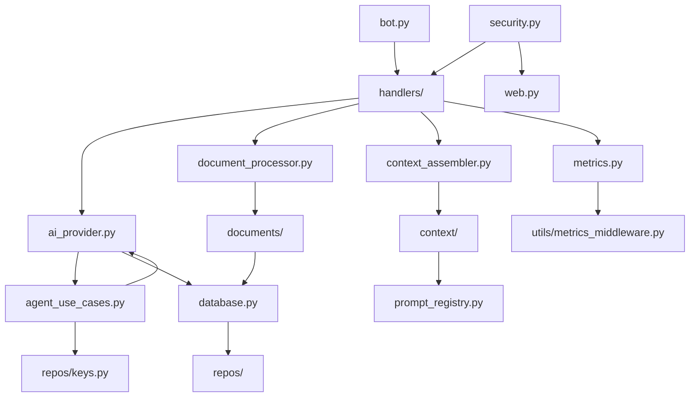

# Architecture Overview — GemAI Bot v2

> **Version 2.8.1** • Last updated: 2026-03-03

## Project Map

```
gemaibotv2/
├── bot.py                    ← Entry point: Telegram PTB Application
├── app/
│   ├── config.py             ← Settings, env loading, model defaults
│   │
│   ├── ── AI Layer ──────────────────────────────────────────
│   ├── ai_provider.py        ← BaseAIProvider → GeminiProvider, OpenRouterProvider, ProviderRouter
│   ├── agent_use_cases.py    ← AgentRequestUseCase — key rotation, provider dispatch
│   ├── model_selector.py     ← Smart model fallback logic
│   ├── streaming.py          ← Async streaming response handling
│   │
│   ├── ── Context & Prompts ─────────────────────────────────
│   ├── context_assembler.py  ← Thin facade → app.context
│   ├── context/              ← Token-budget assembler (split module)
│   │   ├── assembler.py      ←   Core ContextAssembler class
│   │   ├── summarizer.py     ←   LLM refine-chain summarization
│   │   └── token_budget.py   ←   Constants + TokenBudget / AssembledContext dataclasses
│   ├── prompts.py            ← Prompt construction + custom role caching
│   ├── prompt_registry.py    ← Template registry, token estimation
│   │
│   ├── ── Document Processing ───────────────────────────────
│   ├── document_processor.py ← Orchestrator + facade functions
│   ├── documents/            ← Split module
│   │   ├── repository.py     ←   All async DB CRUD (save, get, delete, stats)
│   │   └── parsers.py        ←   Sync file I/O (hash, temp file)
│   │
│   ├── ── Handlers (Telegram) ───────────────────────────────
│   ├── handlers/
│   │   ├── messages.py       ←   Main message router
│   │   ├── commands.py       ←   /start, /help, /settings, /model, etc.
│   │   ├── callbacks.py      ←   Inline keyboard callback dispatcher
│   │   ├── ai_chat.py        ←   Regular chat message → AI
│   │   ├── ai_core.py        ←   AI response error handling
│   │   ├── ai_document.py    ←   Document Q&A with AI
│   │   ├── ai_photo.py       ←   Photo/image analysis
│   │   ├── ai_search.py      ←   Web search + AI synthesis
│   │   ├── agent.py          ←   Agentic mode handler
│   │   ├── msg_document.py   ←   Document upload handler
│   │   ├── msg_media.py      ←   Media message handler
│   │   ├── msg_roles.py      ←   Role-related message handling
│   │   ├── menus.py          ←   Menu generation
│   │   ├── cb_roles.py       ←   Role callback handlers
│   │   ├── cb_conversations.py ← Conversation callback handlers
│   │   ├── cb_documents.py   ←   Document callback handlers
│   │   ├── cmd_admin.py      ←   Admin-only commands
│   │   └── cmd_conversations.py ← Conversation commands
│   │
│   ├── ── Data Layer ────────────────────────────────────────
│   ├── database.py           ← DatabaseManager (asyncpg pool)
│   ├── db/
│   │   ├── schema.py         ←   Table definitions
│   │   ├── migrations.py     ←   Schema migrations
│   │   ├── rls.py            ←   Row-Level Security policies
│   │   └── seed.py           ←   Seed data
│   ├── repos/                ← Repository pattern (per-domain)
│   │   ├── users.py          ←   User CRUD
│   │   ├── keys.py           ←   API key management + rotation
│   │   ├── chats.py          ←   Chat state
│   │   ├── conversations.py  ←   Conversation storage
│   │   ├── memory.py         ←   Long-term memory
│   │   ├── roles.py          ←   Custom roles
│   │   ├── analytics.py      ←   Usage analytics
│   │   ├── metrics_repo.py   ←   Metrics persistence
│   │   ├── admin.py          ←   Admin queries
│   │   └── user_stats.py     ←   User statistics
│   │
│   ├── ── Infrastructure ────────────────────────────────────
│   ├── security.py           ← RateLimiter, SyncRateLimiter, InputSanitizer
│   ├── errors.py             ← ErrorCode enum, tag_error, classifiers
│   ├── cache.py              ← Redis cache wrapper
│   ├── circuit_breaker.py    ← CircuitBreaker for external API resilience
│   ├── resilience_policy.py  ← Retry + timeout policies
│   ├── degradation.py        ← Graceful degradation modes
│   ├── crypto.py             ← Key encryption/decryption
│   ├── state.py              ← ChatState, in-memory session state
│   ├── memory_manager.py     ← Long-term memory management
│   ├── queue.py              ← Request queue with priorities
│   ├── group_chat.py         ← Group chat handling
│   ├── search_services.py    ← Tavily/web search integration
│   ├── request_context.py    ← contextvars request_id propagation
│   ├── tracing.py            ← Distributed tracing support
│   │
│   ├── ── Observability ─────────────────────────────────────
│   ├── metrics.py            ← MetricsCollector, RoleConversationMetricsCollector
│   ├── prometheus.py         ← Prometheus metrics export
│   ├── utils/
│   │   ├── metrics_middleware.py ← MetricsMiddleware + track_metrics decorator
│   │   ├── api_logger.py     ← Structured API call logging
│   │   ├── logging_config.py ← JSON logging setup
│   │   └── ...               ← keyboards, formatting, images, network, etc.
│   │
│   └── web.py                ← Quart web dashboard + API
│
├── tests/                    ← 619 tests (pytest)
├── .github/workflows/ci.yml  ← CI: lint → test → Docker build
├── Dockerfile                ← Production container
└── requirements.txt          ← Python dependencies
```

## Key Architecture Patterns

### 1. Provider Abstraction

```
BaseAIProvider (abstract)
├── GeminiProvider     ← Google Gemini API (native)
└── OpenRouterProvider ← OpenRouter API (multi-model)

ProviderRouter → selects provider based on model name + key availability
```

### 2. Repository Pattern

Database access is organized per domain (`repos/`). Each repository module contains only SQL queries and data mapping — no business logic.

### 3. Facade + Subpackage Pattern

Large modules are split into focused subpackages with a thin facade at the original import path for backward compatibility:

| Facade (old path)       | Package (actual code) | Submodules                          |
| ----------------------- | --------------------- | ----------------------------------- |
| `context_assembler.py`  | `app/context/`        | assembler, summarizer, token_budget |
| `document_processor.py` | `app/documents/`      | repository, parsers                 |
| `metrics.py`            | `app/utils/`          | metrics_middleware                  |

**All existing `from app.context_assembler import X` imports continue working unchanged.**

### 4. Security Layers

```
InputSanitizer → RateLimiter → CircuitBreaker → ProviderRouter → API
```

- Rate limiting at both async (API) and sync (web login) levels
- Error codes with `ErrorCode` enum for O(1) classification
- Key rotation with health scoring per provider

### 5. Observability Stack

```
request_context.py  →  contextvars request_id
api_logger.py       →  structured JSON logs
metrics.py          →  in-process MetricsCollector
metrics_middleware   →  @track_metrics decorator
prometheus.py       →  /metrics endpoint
```

## Dependency Flow



## Test Structure

| Test File                      | Module Under Test                            | Tests         |
| ------------------------------ | -------------------------------------------- | ------------- |
| `test_token_budget.py`         | `app/context/token_budget.py`                | 11            |
| `test_context_assembler.py`    | `app/context/assembler.py` + `summarizer.py` | 35            |
| `test_documents_parsers.py`    | `app/documents/parsers.py`                   | 11            |
| `test_documents_repository.py` | `app/documents/repository.py`                | 18            |
| `test_document_security.py`    | `app/document_processor.py`                  | varies        |
| `test_metrics_middleware.py`   | `app/utils/metrics_middleware.py`            | 7             |
| `test_metrics_*.py` (4 files)  | `app/metrics.py`                             | varies        |
| `test_ai_provider.py`          | `app/ai_provider.py`                         | varies        |
| ...                            | 60+ additional test files                    | ...           |
| **Total**                      |                                              | **619 tests** |
