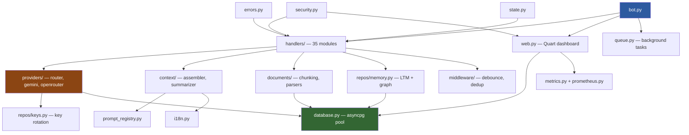

# Architecture Overview — GemAI Bot v2

> **Last updated**: 2026-04-03

## Project Map

```
gemaibotv2/
├── bot.py                        ← Entry point: Telegram PTB + Quart lifecycle
├── app/
│   ├── config.py                 ← Pydantic Settings, env loading, hot-reload
│   │
│   ├── ── AI Layer ──────────────────────────────────────────────
│   ├── providers/                ← Provider abstraction (Facade + Subpackage)
│   │   ├── base.py              ←   BaseProvider ABC
│   │   ├── gemini.py            ←   Google Gemini (native genai SDK)
│   │   ├── openrouter.py        ←   OpenRouter (HTTPX, multi-model)
│   │   ├── router.py            ←   ProviderRouter — key rotation, health scoring, fallback
│   │   ├── imagen_provider.py   ←   Google Imagen 4 image generation
│   │   ├── pollinations.py      ←   Pollinations.ai image generation
│   │   ├── elevenlabs_tts.py    ←   ElevenLabs TTS (primary voice)
│   │   └── tts.py               ←   Gemini TTS (fallback voice)
│   ├── streaming.py             ← StreamingWriter — debounced multi-message Telegram updates
│   │
│   ├── ── Agentic Research ──────────────────────────────────────
│   ├── core/
│   │   ├── agentic.py           ←   Multi-step query decomposition, tool use, web browsing
│   │   └── entities.py          ←   Research entities / data models
│   │
│   ├── ── Context & Prompts ─────────────────────────────────────
│   ├── context/                  ← Token-budget-aware context assembly
│   │   ├── assembler.py         ←   ContextAssembler — history assembly + trimming
│   │   ├── summarizer.py        ←   LLM-backed compressed summaries
│   │   └── token_budget.py      ←   Model-specific token budgets + dataclasses
│   ├── prompt_registry.py       ← Versioned prompt templates, LRU-cached rendering
│   ├── i18n.py                  ← Bilingual RU/EN string registry (Cyrillic density detection)
│   │
│   ├── ── Document Processing ───────────────────────────────────
│   ├── documents/
│   │   ├── chunking.py          ←   Recursive, hierarchical, query-aware chunking
│   │   ├── repository.py        ←   Document DB CRUD
│   │   └── parsers.py           ←   PDF/DOCX extraction
│   │
│   ├── ── Handlers (Telegram) ───────────────────────────────────
│   ├── handlers/                 ← 35 handler modules, organized by domain:
│   │   ├── messages.py          ←   Main message router + debounce integration
│   │   ├── commands.py          ←   /start, /help, /settings, /model, etc.
│   │   ├── callbacks.py         ←   Inline keyboard callback dispatcher
│   │   ├── ai_chat.py           ←   Text → AI with LTM recall
│   │   ├── ai_core.py           ←   AI response error handling
│   │   ├── ai_document.py       ←   Document Q&A
│   │   ├── ai_photo.py          ←   Image analysis (Shannon entropy adaptive resize)
│   │   ├── ai_search.py         ←   Quick search (Google Grounding) + deep search
│   │   ├── agent.py             ←   Agentic research handler
│   │   ├── chat_logic.py        ←   Shared chat processing utilities
│   │   ├── msg_document.py      ←   Document upload handler
│   │   ├── msg_media.py         ←   Media group handler (photos, video)
│   │   ├── msg_voice.py         ←   Voice message ASR + intent routing
│   │   ├── msg_roles.py         ←   Role-related message handling
│   │   ├── msg_reactions.py     ←   Telegram reactions handler
│   │   ├── menus.py             ←   Menu generation
│   │   ├── cb_ai_actions.py     ←   AI action callbacks (continue, regenerate)
│   │   ├── cb_branches.py       ←   Conversation branching callbacks
│   │   ├── cb_conversations.py  ←   Conversation management callbacks
│   │   ├── cb_documents.py      ←   Document callbacks
│   │   ├── cb_feedback.py       ←   User feedback callbacks
│   │   ├── cb_fwd_save.py       ←   Forwarded message save-to-memory
│   │   ├── cb_image.py          ←   Image generation callbacks
│   │   ├── cb_models.py         ←   Model selection callbacks
│   │   ├── cb_navigation.py     ←   Navigation callbacks (settings, back)
│   │   ├── cb_roles.py          ←   Role CRUD callbacks
│   │   ├── cb_voice.py          ←   Voice callbacks (TTS, retranscribe)
│   │   ├── cmd_admin.py         ←   Admin-only commands
│   │   ├── cmd_asr_test.py      ←   /asr developer ASR testing
│   │   ├── cmd_conversations.py ←   Conversation commands
│   │   ├── cmd_image.py         ←   /draw, /img image generation commands
│   │   ├── cmd_reminders.py     ←   /remind system (23KB, full reminder pipeline)
│   │   ├── memory_commands.py   ←   /memory, /clearmemory
│   │   └── scheduled_briefs.py  ←   Intelligence brief subscriptions
│   │
│   ├── ── Data Layer ────────────────────────────────────────────
│   ├── database.py              ← DatabaseManager singleton (asyncpg pool, retry/reconnect)
│   ├── db/
│   │   ├── schema.py            ←   Startup table validation (EXPECTED_TABLES)
│   │   ├── migrations.py        ←   Sequential migration runner (schema_migrations table)
│   │   ├── rls.py               ←   Row-Level Security policies
│   │   └── seed.py              ←   Seed data (admin user, API keys, indexes)
│   ├── repos/                    ← Repository pattern — 14 modules, per-domain SQL
│   │   ├── users.py             ←   User CRUD
│   │   ├── keys.py              ←   API key management, rotation, health scoring
│   │   ├── chats.py             ←   Chat state + message history
│   │   ├── conversations.py     ←   Named conversation storage
│   │   ├── branches.py          ←   Conversation branching (snapshot/restore)
│   │   ├── memory.py            ←   LTM: pgvector storage, RRF search, graph traversal
│   │   ├── memory_consolidation.py ← GraphRAG consolidation (entity/relation extraction)
│   │   ├── roles.py             ←   Custom AI roles
│   │   ├── reminders.py         ←   Reminder persistence
│   │   ├── analytics.py         ←   Usage analytics
│   │   ├── metrics_repo.py      ←   Metrics persistence (delta-based increments)
│   │   ├── admin.py             ←   Admin queries
│   │   └── user_stats.py        ←   User statistics
│   │
│   ├── ── Middleware & Adapters ──────────────────────────────────
│   ├── middleware/
│   │   ├── debounce.py          ←   1.1s trailing message aggregation (22KB)
│   │   └── dedup.py             ←   MD5 double-tap prevention (3s window)
│   ├── adapters/
│   │   ├── concurrency.py       ←   Redis-backed distributed semaphores
│   │   └── ui_adapter.py        ←   StreamingUIAdapter for message editing
│   │
│   ├── ── Infrastructure ────────────────────────────────────────
│   ├── security.py              ← RateLimiter (async), SyncRateLimiter, InputSanitizer
│   ├── errors.py                ← ErrorCode enum (17 types), tag_error, handle_api_errors CM
│   ├── cache.py                 ← Redis cache wrapper
│   ├── circuit_breaker.py       ← CircuitBreaker for external API resilience
│   ├── state.py                 ← UserState with LRU cache + debounced DB persistence
│   ├── memory_manager.py        ← Process memory monitoring (psutil) + auto-cleanup
│   ├── queue.py                 ← Background task queue with priorities
│   ├── group_chat.py            ← Group chat authorization and handling
│   ├── request_context.py       ← contextvars request_id propagation
│   │
│   ├── ── Observability ─────────────────────────────────────────
│   ├── metrics.py               ← MetricsCollector, RoleConversationMetricsCollector
│   ├── prometheus.py            ← Prometheus /metrics endpoint
│   ├── utils/                    ← 21 utility modules:
│   │   ├── api_logger.py        ←   Structured KEY_EVENT logging
│   │   ├── audio.py             ←   Audio format conversion (ffmpeg)
│   │   ├── background_tasks.py  ←   submit_task, submit_retryable (exponential backoff)
│   │   ├── decorators.py        ←   @track_metrics, @admin_only, @ensure_registered
│   │   ├── formatting.py        ←   TelegramFormatter (Markdown→HTML)
│   │   ├── heartbeat.py         ←   ChatAction heartbeat during processing
│   │   ├── image.py             ←   Image helper functions
│   │   ├── image_utils.py       ←   Shannon entropy resize, compression pipeline
│   │   ├── json_utils.py        ←   Safe JSON serialization
│   │   ├── keyboards.py         ←   Inline keyboard builders
│   │   ├── logging_config.py    ←   JSON/text logging setup (LOG_FORMAT detection)
│   │   ├── messaging.py         ←   Message sending utilities
│   │   ├── metrics_middleware.py ←   @track_metrics decorator
│   │   ├── multimodal_processor.py ← Voice/image/document preprocessing pipeline
│   │   ├── network.py           ←   HTTPX client utilities, retry helpers
│   │   ├── stage_indicators.py  ←   Research progress indicators
│   │   ├── text_format.py       ←   Markdown/HTML sanitization (16KB)
│   │   ├── time.py              ←   Time parsing (bilingual EN/RU)
│   │   └── waiting_facts.py     ←   Fun facts during AI processing wait
│   │
│   ├── web.py                   ← Quart dashboard, SSE live updates, batch API
│   └── templates/               ← Jinja2 HTML templates for admin dashboard
│
├── scripts/migrations/           ← 29 numbered SQL migration files (000-026b)
├── tests/                        ← 1421+ tests across 140 files (pytest + pytest-xdist)
├── docs/                         ← This file + extended documentation
├── .github/workflows/ci.yml     ← CI: lint (Ruff) → type-check (Mypy) → unit → integration
├── Dockerfile.northflank         ← Production container (Python 3.14-slim, non-root)
├── docker-compose.northflank.yml ← Production compose (resource limits, health checks)
├── requirements.txt              ← Production Python dependencies
├── requirements-dev.txt          ← Development/test dependencies
├── pyproject.toml                ← Ruff + Mypy configuration
└── start.sh                      ← Startup script with env validation
```

## Key Architecture Patterns

### 1. Provider Abstraction (Facade + Factory)

```
BaseProvider (ABC in providers/base.py)
├── GeminiProvider     ← Google Gemini API (native google-genai SDK)
├── OpenRouterProvider ← OpenRouter API (HTTPX, multi-model)
├── ImagenProvider     ← Google Imagen 4 (per-key RPD budget)
├── PollinationsProvider ← Pollinations.ai (keyless-capable, POST→GET fallback)
├── ElevenLabsTTS      ← ElevenLabs TTS (key-rotation load-balanced)
└── GeminiTTS          ← Gemini REST TTS (atomic fallback)

ProviderRouter → selects provider based on model name + key health scoring
               → automatic key rotation on 503/UNAVAILABLE
               → model fallback cascade (tier-based)
```

### 2. Repository Pattern

Database access is organized per domain in `repos/` (14 modules). Each module contains only SQL queries and data mapping — no business logic. Business logic lives in handlers and providers.

### 3. Error Classification (O(1))

```python
ErrorCode(Enum)         →  17 exception types + 8 HTTP status codes
tag_error(message, code) →  appends invisible zero-width-space tag to Telegram text
classify_error(text)     →  O(1) lookup from tagged message
handle_api_errors()      →  async context manager for unified error UI
```

### 4. State Management (Dual-Store)

```
In-memory LRU Cache (configurable via LRU_STATE_CACHE_SIZE)
    ↕  debounced 300ms persistence
PostgreSQL (user_states table)
```

`UserState` uses `__slots__` for memory efficiency. Active task and last-bot-message registries are in-memory only.

### 5. Streaming Architecture

```
ProviderRouter.stream_response()  →  async generator yielding text deltas
    ↓
StreamingWriter                   →  debounced Telegram editMessageText
    ↓ (on overflow > 4000 chars)
_overflow_to_new_message()        →  markdown-continuity-aware message chain
```

Handles: unclosed code blocks, bold, italic, strikethrough across message boundaries.

### 6. Memory System (GraphRAG)

```
                   Multi-Query Expansion (Flash-Lite LLM, ~200ms)
                          ↓
User Query  →  _get_embedding()  →  pgvector cosine + pg_trgm RRF
                                         ↓
                                  Adaptive Gap Filtering (≤15pp from top)
                                         ↓
                      2-Hop Graph Traversal (memory_nodes → memory_edges)
                                         ↓
                              Core Persona edges (is_core=TRUE, no decay)
                                         ↓
                           Injected as <long_term_memory> XML into system_instruction
```

Consolidation triggers at ~8,000 tokens OR 7 days → LLM extracts persona facts + entities + relations.

### 7. Security Layers

```
InputSanitizer → Dedup Middleware → Debounce → RateLimiter → CircuitBreaker → ProviderRouter → API
```

- Rate limiting at async (API) and sync (web login) levels
- CSRF-protected dashboard with brute-force protection (60 req/min/IP)
- API key masking in all status endpoints
- GDPR: `/mydata` export, `/deleteme` full deletion

### 8. Observability Stack

```
request_context.py  →  contextvars-based request_id propagation
api_logger.py       →  structured KEY_EVENT logging (usage milestones, rotations)
metrics.py          →  in-process MetricsCollector (delta-based persistence)
prometheus.py       →  /metrics endpoint
web.py              →  SSE live updates (5s interval), batch API endpoint
logging_config.py   →  JSON/text logging (auto-detected from LOG_FORMAT env)
```

## Dependency Flow



## CI Pipeline

```
Push to main/TEST_gemaibotv2 ─→ Lint (Ruff check + format) ─→ Type Check (Mypy)
                                                                    ↓
                                                            Unit Tests (fast, mocked)
                                                                    ↓ (main only)
                                                         Integration Tests (PostgreSQL)
```

- Python 3.14 with `allow-prereleases: true`
- Concurrency groups cancel superseded runs
- Unit tests run on all pushes/PRs; integration tests only on `main` push

## Testing

| Metric | Value |
|--------|-------|
| Test files | 140 |
| Total tests | 1421+ |
| Line coverage | ~60% |
| Parallelism | `pytest-xdist` (`-n auto`) |
| Timeout | 30s per test |
| Async mode | `auto` (`pytest-asyncio`) |

Tests are organized by module, with `test_*.py` naming. Integration tests are marked with `@pytest.mark.integration` and require a live PostgreSQL connection.
