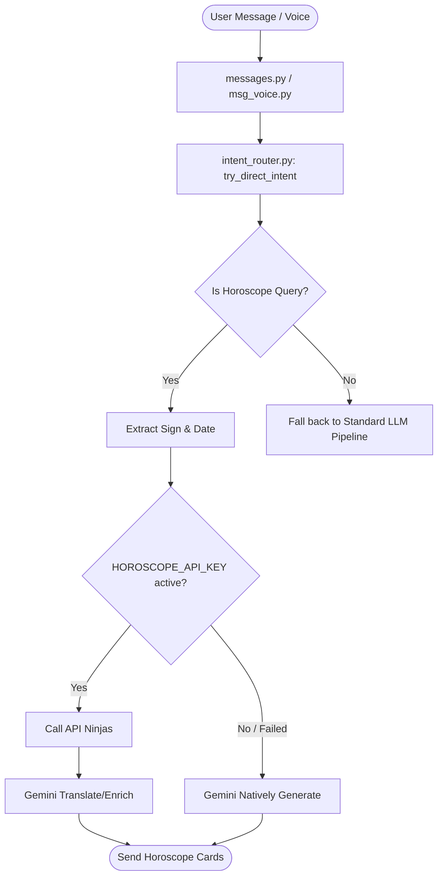

# Design Spec: Horoscope Intent & API Integration (2026-05-24)

This specification details the design and implementation plan for adding a horoscope query intent to gemaibotv2, mirroring the existing architecture for weather and currency rate queries.

## 1. Overview & Objectives

The goal is to allow users to ask the bot for a daily horoscope (for any zodiac sign and day) through both normal text messages and transcribed voice messages, completely bypassing the main LLM pipeline when a simple query is detected (Direct Routing).

### Core Features
1. **Zodiac & Date Parsing**: Detect zodiac signs (in various Russian grammatical cases) and date intents (сегодня, завтра, вчера, послезавтра) from user input.
2. **API Ninjas Horoscope Integration**: Integrate with the API Ninjas Horoscope API as the primary structured source.
3. **Gemini Translator & Enrichment**: Since API Ninjas returns English responses, use a fast, lightweight Gemini model (`gemini-2.5-flash-lite`) to translate and format the horoscope beautifully in Russian.
4. **Native Gemini Generator Fallback**: If the `HOROSCOPE_API_KEY` is not configured, automatically fall back to Gemini to generate a highly engaging daily horoscope natively in Russian.
5. **Runtime Key Management**: Expose `HOROSCOPE_API_KEY` in the `/keys` admin panel with built-in health checking.

---

## 2. Component Design & Changes



### A. Intent Router (`app/intent_router.py`)
- Add a new regex pattern `_HOROSCOPE_PATTERNS` to detect general horoscope queries (e.g. `гороскоп`, `zodiac`, `horoscope`).
- Add a regex-based mapping `_ZODIAC_MAPPING` to map Russian zodiac sign names in any grammatical case to their English counterparts (e.g., `овна`, `льву` → `aries`, `leo`).
- Implement `_handle_horoscope(text: str) -> IntentResult | None`:
  - Detect zodiac sign. If no sign is found, return a polite prompt containing a quick-reference guide of signs (e.g. *"🔮 Пожалуйста, укажите ваш знак зодиака в запросе..."*).
  - Extract the temporal target (defaulting to today).
  - Check for `HOROSCOPE_API_KEY` via `get_provider_key("horoscope")`.
  - If present, call `GET https://api.api-ninjas.com/v1/horoscope` with the sign and optional date, then invoke `gemini-2.5-flash-lite` to translate/enrich the response into a Russian horoscope card.
  - If absent/failed, invoke `gemini-2.5-flash-lite` with a dedicated prompt to generate a beautiful, native Russian daily horoscope.

### B. Keys Wizard & Health Check (`app/handlers/cmd_keys.py` & `app/repos/provider_keys.py`)
- Add `"horoscope": "HOROSCOPE_API_KEY"` to the environment mapping.
- Add `"horoscope": "🔮 Horoscope"` to the provider grid.
- Add an explicit health-check endpoint mapping:
  `"horoscope": "https://api.api-ninjas.com/v1/horoscope?zodiac=aries"`
- Update `check_single_provider_health` to inject the `X-Api-Key` header when checking the `horoscope` provider.

---

## 3. Implementation Details

### Russian Zodiac Mapping
```python
_ZODIAC_MAPPING = {
    "aries": re.compile(r"\b(?:овен|овна|овну|овном|овне|aries)\b", re.IGNORECASE),
    "taurus": re.compile(r"\b(?:телец|тельца|тельцу|тельцом|тельце|taurus)\b", re.IGNORECASE),
    "gemini": re.compile(r"\b(?:близнецы|близнецов|близнецам|близнецами|близнецах|gemini)\b", re.IGNORECASE),
    "cancer": re.compile(r"\b(?:рак|рака|раку|раком|раке|раки|раков|cancer)\b", re.IGNORECASE),
    "leo": re.compile(r"\b(?:лев|льва|льву|львом|льве|львы|львов|leo)\b", re.IGNORECASE),
    "virgo": re.compile(r"\b(?:дева|девы|деве|деву|девой|дев|virgo)\b", re.IGNORECASE),
    "libra": re.compile(r"\b(?:весы|весов|весам|весами|весах|libra)\b", re.IGNORECASE),
    "scorpio": re.compile(r"\b(?:скорпион|скорпиона|скорпиону|скорпионом|скорпионе|скорпионы|скорпионов|scorpio)\b", re.IGNORECASE),
    "sagittarius": re.compile(r"\b(?:стрелец|стрельца|стрельцу|стрельцом|стрельце|стрельцы|стрельцов|sagittarius)\b", re.IGNORECASE),
    "capricorn": re.compile(r"\b(?:козерог|козерога|козерогу|козерогом|козероге|козероги|козерогов|capricorn)\b", re.IGNORECASE),
    "aquarius": re.compile(r"\b(?:водолей|водолея|водолею|водолеем|водолее|водолеи|водолеев|aquarius)\b", re.IGNORECASE),
    "pisces": re.compile(r"\b(?:рыбы|рыбы|рыбе|рыбу|рыбой|рыб|рыбам|рыбами|рыбах|pisces)\b", re.IGNORECASE),
}
```

### Gemini Generation Prompt (Fallback)
```python
SYSTEM_INSTRUCTION = (
    "Ты — профессиональный, дружелюбный и харизматичный астролог.\n"
    "Составь интересный, вдохновляющий и точный ежедневный гороскоп на русском языке "
    "для знака {sign_ru} на {day_ru}.\n"
    "Гороскоп должен быть структурированным, содержать полезные советы по разным сферам (любовь, карьера, здоровье) "
    "и использовать красивые эмодзи. Не делай ответ слишком длинным (не более 3-4 небольших абзацев)."
)
```

---

## 4. Verification Plan

### Automated Unit Tests
- Add a new test suite `tests/test_horoscope_intent.py` validating:
  1. Correct extraction of all 12 zodiac signs in various grammatical cases.
  2. Correct date parsing ("сегодня", "завтра", "вчера", "послезавтра").
  3. Direct intent router execution with and without `HOROSCOPE_API_KEY`.
  4. Prompt validation for cases when the sign is missing.

### Manual Verification
- Test key registration via `/keys` panel.
- Send text queries (e.g. "гороскоп овен на завтра", "какой сегодня гороскоп для льва?") and verify instant, beautifully formatted markdown cards.
- Send voice messages asking for horoscopes and verify they auto-route cleanly.
