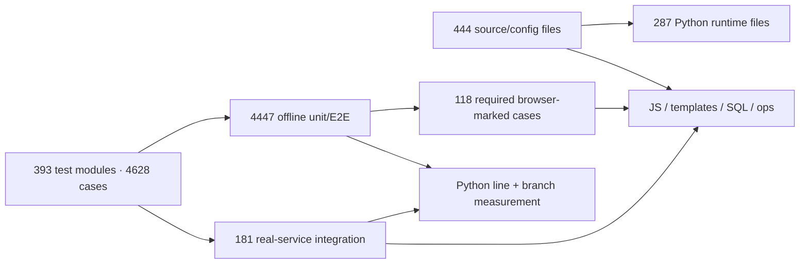

# Исправление и расширение тестового покрытия — 2026-10-09

Выполнены все 30 сценариев из [исходного аудита](test-coverage-map-2026-10-09.md).
Исправлены 18 замечаний к актуальности, объективности и полезности существующих
тестов; ещё два замечания сохранены как честные ограничения полезных проверок.
Воспроизведённые дефекты кода исправлены и независимо перепроверены.

Результаты относятся к рабочему дереву `vps_testai` поверх
`6c3143d88de0aed5f789e81dae468c538ae0c0c1`. Изменения не закоммичены;
commit, push, PR и deploy не выполнялись. Исходные изменения пользователя и
датированные измерения аудита сохранены.

## Проверенное состояние

| Показатель | Исходный аудит | После исправлений |
| --- | ---: | ---: |
| Исходники/config в инвентаре | 441 | 444 |
| Тестовые модули | 363 | 393 |
| Test functions | 3439 | 3639 |
| Collected cases | 4175 | 4628 |
| Offline unit/E2E passed | 4081 | **4447** |
| Integration cases | 94, не запускались | **181 passed** |
| Required browser-marked gate | 77 passed | **118 passed** |
| Пропуски / ошибки в финальных прогонах | 0 в offline | **0 / 0** |

Browser gate включает Chromium и Node VM AudioWorklet проверки. Его 118 случаев
входят в 4447 offline cases; повторный обязательный запуск подтверждает discovery
и наличие browser toolchain. Их нельзя прибавлять к 4628 уникальным cases.
Integration выполнен на настоящих изолированных PostgreSQL/pgvector, Redis и
четырёх pinned Docker services observability; fixtures создавали disposable
database clones и отдельные Redis namespaces.

Offline measurement занял 425.84s,
integration — 50.90s,
required browser gate — 118.61s.
Версии: Python 3.14.3, uv 0.12.6, pytest 9.1.1, Ruff 0.15.2. Dependency manifest и
lockfile не менялись. Offline recorder зарегистрировал ноль запрещённых Python
socket attempts. `.env` не читался, использовались синтетические credentials.
Это guards тестового процесса, не OS sandbox для всех дочерних процессов.

## Схема покрытия

Полная адресуемая матрица — [closure.csv](test-coverage/2026-10-09-improvements/closure.csv)
и [evidence.json](test-coverage/2026-10-09-improvements/evidence.json).
Для каждого из 50 исходных ID сохранены acceptance, решающий oracle, точные
параметризованные nodeids, результат выполнения, source fixes, independent review
и ограничения. Все решающие nodeids найдены в окончательной collection и прошли.

[sources.csv](test-coverage/2026-10-09-improvements/sources.csv) содержит каждый
source file, SHA-256, изменение относительно baseline, coverage, количество и
примеры passed execution contexts. Полный набор контекстов сохранён в JSON.
Исполненная строка или импорт — самостоятельный слой evidence, который
не заменяет проверку поведения. [cases.csv](test-coverage/2026-10-09-improvements/cases.csv)
содержит все 4628 случаев и разделение offline/integration/browser.

| Область / исходные ID | Решающий проверенный контракт |
| --- | --- |
| CORE-G01/G02/G06 | Реальная private delivery, отсутствие Reader/Telegraph/background публикации, частичная Telegram публикация без durable/memory/voice success effects, kill+await ffmpeg при timeout/cancellation. |
| CORE-G03/G04 | Cleanup/lifecycle errors и ownership; PostgreSQL optimistic CAS с конкурирующими connections. |
| CORE-G05/G07/G08/G09 | Malformed streams и losing race cleanup; actual album dispatcher с bounded download/order/identity; FTA model/key classification; native SDK/SSE/HTTP adapters. |
| ST-01/ST-02/ST-03 | Committed consent barriers/leases, отмена и ошибка drain против E3, caller-owned graph transaction/provenance и rollback, nonowner RLS USING/WITH CHECK и pool reset. |
| ST-04/ST-05/ST-06/ST-07 | Compaction/drain и repeated cancel reason, debounce timer/STT ownership, eviction/GC canonical UserState lock, real Redis capacity/server clock/renewal/release/fallback. |
| ST-08/ST-09 | Legacy migration upgrades и CLI/startup serialization; concurrent trivia finish и score idempotency. |
| product-01/product-02 | Sticky unranked client recovery Daily2048 с сохранением gameplay/active clock; board actor/message binding. |
| product-03/product-04 | Natal queued access revocation до provider/save/cover/public mirrors; real PostgreSQL owner/JSONB/SVG/TTL maintenance. |
| product-05/product-08 | Horoscope replica claim, partial failure/retry/COMMIT rollback/date; actual Redis preparation lease fencing и classic WebSocket pending-ID dedup. |
| product-06/product-07 | Destructive callback scope, stale/replay/error effects; voice pending/message/consent/source-lock ownership и cancellation races. |
| ROOT-01/ROOT-02/ROOT-03 | Actual discovery/effective CI selection; continuous PCM sample-count oracle и mic resource lifecycle; memory delete undo/failure/reload/navigation и Reader TTS actual teardown. |
| ROOT-04 | Полный stdout → Docker proxy → Alloy → Loki → authenticated Grafana, source filters/privacy/limits, readiness и owned probe cleanup. |

## Обнаруженные и исправленные дефекты

Новые проверки сначала воспроизводили реальное ошибочное поведение; корректное
существующее поведение получало полезный GREEN без искусственного RED.

- Voice callback cancellation и повторная отмена cleanup больше не оставляют
  worker/resource без владельца и сохраняют исходную причину отмены. Старый
  debounce owner не удаляет новый slot; LRU eviction сохраняет живой state/lock.
- Redis LLM admission выполняет expiry/count/insert атомарно и использует server
  `TIME` при admission/renewal. Задержанный EVAL и различающиеся client clocks
  больше не позволяют немедленно просрочить новый lease. Renewal не воскрешает
  утраченный token.
- FTA различает явный неверный/просроченный credential и model/tier denial.
  До видимого текста сохраняется подходящий key fallback; после текста повтор
  не запускается. Native/routed streams закрывают owned response/generator.
- Horoscope replicas используют transaction-bound claim и проверку актуального
  слота; failure UPDATE/COMMIT не оставляет success marker. Crocodile не повторяет
  mutation body в Redis fallback и не принимает один pending guess дважды.
- RLS group membership больше не рекурсирует; прямое самостоятельное membership
  write не проходит nonowner policy. Trivia terminal completion не начисляет
  повторный score; migration CLI разделяет startup lock. Недоверенный Daily2048
  recovery остаётся доступен для gameplay и не участвует в рейтинге.
- AudioWorklet сохраняет непрерывную временную шкалу 16k/44.1k/48k input вместо
  потери samples на границах quantum. Late permission/worklet continuation не
  запускает отменённый microphone owner. Undo возвращает видимую memory card.
- `ConfigManager.settings` проверяет running loop до создания coroutine и
  продвижения reload timestamp. Overdue synchronous read не создаёт orphan и
  сохраняет следующую async reload opportunity. Этот дефект обнаружен финальным
  общим прогоном; четыре детерминированных regressions и свежий полный прогон
  подтверждают исправление. Warning policy не ослаблялась.

Observability probe получил **128 valid events**, **2 invalid lines** и проверил
**2 excluded sources**. Required datasource tests — **6 passed** в составе
integration. Privacy event сериализован настоящим application writer: credential
echo redacted, birth/private-memory bodies forbidden, typed suffix/fingerprint
сохранены. Redaction является контрактом application writer; Alloy переносит
защищённый результат.

При восстановлении реального stack Alloy отвечал `ready`, а повторная config
validation под CPU 0.25 превышала healthcheck 5s. Healthcheck теперь читает
работающий `/-/ready`; отдельная vendor config validation в CI сохранена.
Actual pinned-image probe отвергает 503, misleading500, malformed2000, EOF и
refused connection; все четыре services прошли `--wait`. Probe также сохраняет
original validation error, пытается очистить каждый owned container и ограничивает
query собственным run ID, чтобы старые 500 событий не скрывали новый запуск.
Назначение readiness описано в
[официальной документации Alloy](https://grafana.com/docs/grafana-cloud/send-data/alloy/reference/http/).

## Измерение Python coverage

| Метрика | Baseline offline | Final offline | Final offline + integration |
| --- | ---: | ---: | ---: |
| Statement/line coverage | 68.51% | **70.58%** | **71.59%** |
| Branch coverage | 57.44% | **59.66%** | **60.86%** |
| Weighted coverage.py total | 66.01% | 68.11% | 69.16% |
| Covered statements | 30208 / 44095 | 31417 / 44513 | 31867 / 44513 |

Сопоставимое offline улучшение: **+2.07 п.п. lines** и
**+2.23 п.п. branches**.
Combined показатель объединяет data только двух окончательных passing прогонов
на одинаковых source bytes. Исходный аудит integration не запускал, поэтому его
число не является baseline для combined. SQL/JS/templates/shell/container поведение
не входит в Python line percentage; для него используются реальные assertions.

## Независимая проверка и ограничения

[reviews.md](test-coverage/2026-10-09-improvements/reviews.md) фиксирует review
кохорт и поздних исправлений. Сабагенты получили независимые границы файлов;
для сложных implementation/review использовался xhigh, для узкого исходного
quality review — high. TDD, systematic-debugging, receiving/requesting-code-review,
dispatching-parallel-agents и verification-before-completion применялись по
контракту задачи. Финальный collector запуск и aggregate принадлежали root.

Ruff check, format check (720 файлов), mypy (287 исходников), documentation
encoding/links, environment registry (111 имён), inventory tests и
`git diff --check` прошли.
Итоговое приложение проверено отдельно: ID set50, source/test hashes, exact
nodeid join, current collection, line/branch totals и отсутствие skips/failures.

Полезные узкие проверки `quality-product-07` (legitimate Daily2048 clock/recovery)
и `quality-product-08` (два independent full golden natal cases и offline Horizons
parser fixture) сохранены. Более широкая numerical/live accuracy из них не следует.
Telegram/provider/VPS availability, акустическое качество и реальное семидневное
retention expiry не проверялись. PostgreSQL COMMIT и Telegram send остаются
разными операциями; при partial/unknown acknowledgment повтор prefix возможен.
Redis token loss/outage не останавливает уже работающий provider; local fallback
ограничивает процесс. Privileged runtime DSN может обходить RLS.

## Воспроизведение

Команды и изоляция заданы в [CONTRIBUTING](../CONTRIBUTING.md) и
[AGENTS](../AGENTS.md). Runtime gates используют `uv run --locked`:
`ruff check .`, `ruff format --check .`, `mypy app bot.py` и pytest с явным 30s
timeout. Required browser selection — `pytest tests/ -m browser -n 0` с очищенным
addopts и `GEMAIBOT_REQUIRE_BROWSER_TESTS=1`.

Integration требует явно disposable TEST_DATABASE_URL/TEST_REDIS_URL; новые
contract fixtures создают отдельные clones. Collector требует isolated Docker
daemon, `--ephemeral`, synthetic password/private-event files и generated manifest.
CI observability job выполняет generator/probe/required pytest автоматически.
Deployment выполняет readiness/login gates; свежая VPS ingestion ими не доказана.

Подробные raw RED/GREEN logs, evidence и recovery workspace сохранены в
`.superpowers/sdd/2026-10-09-test-coverage-improvements/`; dated offline recorder
лежит в [offline_audit.py](test-coverage/2026-10-09/offline_audit.py).
Temporary service binaries/data не включены в Git. После окончания всех проверок
root сверил владельцев процессов и остановил PostgreSQL, Redis, Docker VM и
loopback staging. Порты 55479, 56479, 61679, 61680, 61681, 61682 закрыты;
исходные данные и evidence сохранены.
