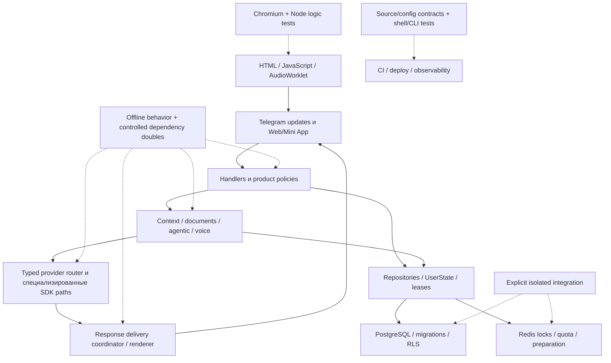

# Карта покрытия и качества тестов — 2026-10-09

Проверен checkout `6c3143d88de0aed5f789e81dae468c538ae0c0c1` с существовавшими
локальными изменениями документации. Карта охватывает **441 файл реализации,
данных и конфигурации**, **363 тестовых модуля**, **3 439 собранных тестовых
функций / 4 175 параметризованных случаев**. Свежий полный прогон выбранной
офлайн части: **4 081 passed**, включая **77 browser cases**, без skipped,
ошибок и warnings. **94 integration cases не запускались**.

Составлена очередь из **30 конкретных недостающих сценариев: 13 P1 и 17 P2**.
К существующим тестам записаны **20 адресных замечаний**: 18 предложений усилить
проверку или привести название к фактическому контракту и 2 ограничения охвата
полезных тестов. Это схема дальнейшего покрытия; runtime и тесты приложения
не изменялись. Отсутствующий oracle не считается доказанным дефектом поведения.

## Полные приложения

| Артефакт | Что содержит |
| --- | --- |
| [Исходники: CSV](test-coverage/2026-10-09/sources.csv) | Все 441 файла: ответственность, слой, SHA-256, метрики, связи с тестами и IDs пробелов |
| [Качество тестов: CSV](test-coverage/2026-10-09/test-quality.csv) | Все 363 модуля: актуальность, сила oracle, полезность, глубина чтения, результаты и ограничения |
| [Полное доказательное приложение: JSON](test-coverage/2026-10-09/evidence.json) | Точные nodeids, 3 439 AST-профилей мест проверок, 4 175 collection/result records, missing lines/branches, scope/fixtures, 30 сценариев, 20 замечаний и независимая перепроверка |
| [Офлайн измеритель](test-coverage/2026-10-09/offline_audit.py) | Воспроизводимый runner с синтетической test environment, защитой `.env`, Python socket guard и branch/test-context coverage |
| [Проба AudioWorklet](test-coverage/2026-10-09/audio_sample_probe.cjs) | Вызов настоящего JS processor на фиксированной секунде PCM; без микрофона и сервера |

JSON хранит пути относительно репозитория. `sources[].tests` — проверенные
связи с конкретными тестами; `static_candidate_test_files` — только подсказки
import/patch/literal поиска. `python_coverage.call_test_files` отражает исполнение
в test-call фазе, включая импорт или транзитивный вызов. `test_oracles` указывает
места `assert`/`raises`/mock assertions в исходном тесте и delegated helpers,
а `test_quality` объясняет их смысл. Ни одна из этих связей отдельно не доказывает
весь контракт исходного модуля.

## Охват и метод

В реализации учтены 287 runtime Python-файлов (`app/` и `bot.py`), 24 Python CLI
под `scripts/`, 2 ручных performance scripts, все 77 SQL-миграций, 7 JS и 6 CSS,
14 HTML templates, 5 workflows, 9 observability configs, 4 deployment files,
5 tooling configs и 1 JSON-колода. Это 133 609 физических строк; тестовые модули
содержат 74 516 строк. Дополнительно проверены границы 9 Python test-support
файлов и двух locked Node manifests. Vendor/cache, внешние revision bundles,
журналы и исторические документы не выдаются за runtime-код.

Для всего выбранного кода построены inventory, AST/definition/import/call связи
и SHA-256. Для всех тестовых модулей разобраны assertions, raises, mock calls,
fixtures и local helpers; критические тела и межмодульные сценарии прочитаны
углублённо. В CSV/JSON указана фактическая глубина review. Ручная построчная
проверка каждого из тысяч тестовых тел не заявляется.

Работа разделена между тремя сабагентами без пересечения файлов: core —
104 source / 110 test modules, `xhigh`; storage — 153 / 120, `xhigh`;
product — 111 / 99, `high`. Все использовали `gpt-6.1-sol`. Основной агент
проверил frontend, CI, tooling и итоговую согласованность: 73 / 34. Storage
независимо пересмотрел core/product выводы; product — root/storage выводы.
Применены `using-superpowers`, `dispatching-parallel-agents`,
`verification-before-completion`; при настройке измерителя —
`systematic-debugging`.

Отчёты от [2026-10-03](test-corpus-audit-2026-10-03.md) и
[43 прежних исправления](test-corpus-fixes-2026-10-03.md) использованы как
историческая навигация. Перепроверены 16 релевантных исправленных core contracts
по текущим assertions. Усиленные deadline, parallel barrier, lease, actual worker
и formatter predicates сохраняются; они не возвращены в backlog автоматически.

## Измеренное покрытие

Финальный прогон: Python 3.14.3, pytest 9.1.1, pytest-cov 6.3.0,
coverage 7.15.4, pytest-asyncio 1.4.0, pytest-timeout 2.4.0, xdist 3.8.0;
установленный uv 0.12.6. Выполнение последовательное, с `--timeout=30`,
очищенным `addopts`, coverage core `ctrace`, `--cov-branch --cov-context=test`.
Время runner — 407,09 секунды. Синтетические credentials установлены до импорта
приложения; `.env` недоступен основному Python-процессу; `TEST_DATABASE_URL` и
`TEST_REDIS_URL` сняты. Запрещены Python service socket connects, кроме внутреннего
stdlib Windows socketpair для asyncio. Заблокированных service attempts — 0.

| Метрика `app/**/*.py` + `bot.py` | Результат |
| --- | --- |
| Python files | 287 |
| Строки с исполнимыми statements | 44 095 |
| Покрытые / непокрытые строки | 30 208 / 13 887 |
| Line coverage | **68,5066%** |
| Покрытые / все ветви | 7 385 / 12 858 |
| Branch coverage | **57,4351%** |
| Смешанный coverage.py показатель | 66,0071%; не равен line coverage |

Группы непересекающиеся; проценты взвешены количеством statements/branches,
а не средним арифметическим файлов. Точный состав каждой группы — `area` в CSV.

| Граница | Файлов | Строки | Ветви |
| --- | ---: | ---: | ---: |
| AI, context, documents, voice orchestration | 26 | 73,28% | 63,01% |
| Providers | 16 | 72,25% | 60,72% |
| Response delivery | 7 | 80,68% | 62,18% |
| Runtime controls/config/catalog | 25 | 90,87% | 82,15% |
| Memory и UserState | 10 | 75,01% | 61,61% |
| Прочие repositories/DB/adapters/middleware | 32 | 62,20% | 50,22% |
| Telegram handlers и intent/tarot | 51 | 50,22% | 38,92% |
| Games | 22 | 74,10% | 59,79% |
| Natal/astro calculations | 27 | 93,32% | 83,55% |
| Web API | 8 | 60,19% | 46,51% |
| Observability | 21 | 83,38% | 69,22% |
| Shared utils/security | 41 | 78,84% | 65,04% |
| Lifecycle `bot.py` | 1 | 31,14% | 21,09% |

SQL, JS, CSS, HTML, CLI и deployment-конфигурация имеют отдельные доказательные
слои; их coverage не приравнивается к Python-процентам. Высокие метрики не
доказывают настоящую SQL-конкуренцию: например, runtime settings store имеет
92,9% строк / 84,7% ветвей, но CAS backend в тесте — fake. Низкие метрики
помогают выбирать рискованные границы: `audio.py` — 10,7% / 0%, `cb_voice.py` —
11,0% / 0%, `cb_conversations.py` — 17,1% / 0%, board handler — 23,3% / 7,4%.

## Схема слоёв и существующих проверок



Специализированные Gemini/embedding/image/Live paths сохраняют собственные
контракты. Схема не предполагает перевод всех SDK consumers на chat router.

| Граница | Уже полезные проверки | Что они доказывают и где заканчиваются |
| --- | --- | --- |
| Router / key/model races | [router](../tests/test_provider_router.py), [hedging](../tests/test_provider_model_hedge.py), [voice cleanup](../tests/test_voice_race_cleanup.py) | Typed events, metadata, deadline/loser cleanup на настоящем orchestration с scripted provider doubles; не live provider quality |
| Delivery | [renderer](../tests/test_telegram_renderer.py), [coordinator](../tests/test_response_coordinator.py), [delivery events](../tests/observability/test_delivery_events.py) | Full split/actions, ordinary fallback, cancellation и transport-failure terminal; ещё нужны private-content и mid-split effects |
| Context/documents/LTM | [context](../tests/test_context_assembler.py), [document lease](../tests/test_ai_document.py), [private leases](../tests/test_private_data_leases.py), [graph writer](../tests/test_memory_graph_writer.py) | Budget/epoch/provider admission, caller-owned transaction и forbidden effects; actual durable interleavings/deferred SQL нужны отдельно |
| Runtime controls | [store](../tests/test_runtime_settings_store.py), [web controls](../tests/test_web_controls.py), [browser controls](../tests/test_controls_commands_browser.py) | Revision semantics и conflict UI на fake SQL/HTTP; реальный PG CAS race отсутствует |
| Storage/migrations | [manifest](../tests/test_migration_invariants.py), [schema](../tests/test_ltm_schema_graph_baseline.py), [PG repositories](../tests/integration/test_repos_chats.py), [conversation isolation](../tests/integration/test_repos_conversations.py) | Numbered manifest/source checks и существующие настоящие PG tests. CI настроен применять цепочку дважды и выполнять `--check`; свежего локального PG результата нет |
| Redis | [semaphore](../tests/test_distributed_semaphore.py), [Redis integration](../tests/integration) | Local/fake orchestration и отдельные реальные Lua ownership/recovery tests существуют; новые сценарии относятся к конкретным preparation/semaphore scripts |
| Games | [2048](../tests/test_daily_2048.py), [trivia](../tests/test_daily_trivia.py), [preparation](../tests/test_daily_preparation.py), [WebSocket](../tests/test_game_websocket.py) | Move/recovery, immutable revision policy, both-track preparation и replay; ranked reachability и реальные межпроцессные races требуют отдельных oracles |
| Natal/compatibility | [accuracy](../tests/test_natal_accuracy.py), [compatibility](../tests/test_compatibility_miniapp.py), [natal ingress](../tests/test_natal_miniapp.py) | Independent static reference fixtures/local math, ingress и compatibility revocation. Natal queued authorization и PG retention roundtrip не заменяются ими |
| Frontend | [2048 browser](../tests/test_daily_2048_frontend.py), [trivia browser](../tests/test_daily_trivia_frontend.py), [compatibility browser](../tests/test_compatibility_form_browser.py), [natal report](../tests/test_natal_web_report.py) | Actual Chromium/JS с controlled HTTP/Telegram surfaces; layouts/reconnect/form validation. Live mic, generic memory UI и Reader lifecycle не исполняются |
| Tooling/logs/deploy | [dependency scripts](../tests/test_dependency_frontier.py), [shell gate](../tests/test_deploy_natal_gate.py), [logging](../tests/observability), [CLI smoke](../tests/observability/test_log_viewer_smoke.py) | Real CLI/shell и config/privacy/synthetic contracts; container readiness/auth не доказывает end-to-end ingestion/VPS/provider availability |

## Где добавлять покрытие

P1 — первая очередь из-за приватности, integrity или критической async границы.
P2 — следующая очередь: расширение гарантий и service/lifecycle semantics.
Приоритет относится к отсутствующему тестовому сценарию. Ниже указан минимальный
результат, который должен отличать корректное поведение от правдоподобной ошибки;
ближайшие существующие nodeids и подробные source anchors есть в JSON.

| ID | Приоритет / слой | Необходимый сценарий и oracle |
| --- | --- | --- |
| CORE-G01 | P1, real delivery + fake Telegram | Длинный `private_content=True` ответ при включённой publication: ноль Reader/Telegraph/background публикаций; полный Telegram split и actions в последнем фрагменте |
| CORE-G02 | P1, fake subprocess | `communicate` зависает, затем cancellation/timeout: bounded outcome, kill и awaited process completion; SDK-race cleanup не заменяет ffmpeg cleanup |
| CORE-G04 | P1, isolated PG | Два store connections с одним expected revision, включая отсутствующую запись: один success/один conflict, атомарная value/history, rollback и отсутствие leaked admin context |
| CORE-G05 | P1, scripted raced streams | Missing terminal/post-terminal delta/BEFORE_TEXT или deferred после текста: заданный error/outcome, один terminal, без смешанного текста; все producer tasks завершены именно при нарушении |
| CORE-G06 | P1, handler + real delivery | Первый split отправлен, второй падает/отменён: точные history/summary/voice/provenance effects, lease cleanup и частичная доставка по явно принятому policy |
| ST-01 | P1, два PG connections | Lease эпохи E, committed barrier E2 и drain/compensation interleavings: запрет новых E effects, ожидание нужных leases, CAS compensation не откатывает superseding E3 |
| ST-02 | P1, actual PG triggers | Удаление одного/последнего source recomposes/deletes attributes/edges без чужих данных; deferred checks выполняются при commit; never-referenced orphan имеет существующий часовой grace |
| ST-03 | P1, nonprivileged PG role | RLS denial чужого tenant для select/write при реальной роли без ownership/BYPASSRLS; policy presence и privileged fixture недостаточны |
| ST-05 | P1, Event-controlled async | Debounce timer/slot/STT overlap, cancel и flush: слот не утечёт/не освободится чужим владельцем, stale task не dispatches duplicate work |
| product-01 | P1, ranked 2048 | Недостижимый client board не повышает ranked score, legitimate reconnect recovery сохраняется. Reachability/active-clock policy уточняется до теста; любой zero elapsed не объявляется ошибкой |
| product-02 | P1, callback + repository | Сообщение доски A с payload ID B, missing actor/noncreator: никакого close B; совпадающий creator/message/payload закрывает ровно A |
| product-03 | P1, queued natal task | Bot access revoked после accepted или во время interpretation: проверка допустимых provider/store/send effects, приватный результат не отправляется при запрещённом доступе; LTM disable/erasure — другой контракт |
| ROOT-01 | P1, CI selection contract | Required browser gate выбирает все 6 modules/77 cases, включая 11 compatibility; новый browser-marked module автоматически включается или вызывает failure contract test |
| CORE-G03 | P2, lifecycle fakes | Error `_cleanup_application`, retry и multi-task orchestration при fault/timeout: порядок cleanup, продолжение после ошибки и awaited tasks. Normal shutdown уже проверяется; watchdog restart сейчас отсутствует |
| CORE-G07 | P2, album async | Mixed download order/failure/cancel: исходный порядок изображений, <=5 concurrent downloads, all-failed без provider, owned progress tasks/epoch lease завершаются |
| CORE-G08 | P2, actual FTA provider + SDK fake | FTA override classification/provider identity, unknown model и inherited typed-stream contract проверяются на FTA entrypoint |
| CORE-G09 | P2, SDK/SSE doubles | Malformed/multiline SSE, text→transport error, empty/whitespace stream и cancellation: накопленный текст, один корректный typed terminal и response/client cleanup |
| ST-04 | P2, direct memory utilities | Timeout drain/compaction ждёт asynchronous finally после cancel, включая error cleanup/direct untracked tasks. Обычный TaskManager drain уже имеет сильный тест |
| ST-06 | P2, small-capacity UserState | Eviction при живом old state reference: lock/persist/background ownership остаётся согласованным. Ordinary Telegram ingress отдельно сериализован и проверен |
| ST-07 | P2, isolated Redis + два clients | Global semaphore contention/TTL expiry/renewal loss: реальная capacity, освобождение только своего token, bounded local fallback |
| ST-08 | P2, disposable legacy PG | UUID graph/legacy trivia JSON upgrade сохраняют отношения/данные; CLI и startup одновременно применяют pending migrations один раз; tracking повторного apply сохраняет данные |
| ST-09 | P2, concurrent PG trivia | Competing publication expected revision: один winner, полный 5+3 snapshot без partial/duplicate, existing result pinned, fault rollback и повторный ответ без второго score |
| product-04 | P2, PG + HTTP | Natal save/hydrate, wrong-owner delete, TTL maintenance, HTTP404 после delete и повторный save: JSONB/SVG/retention roundtrip с явно принятым read-vs-maintenance TTL |
| product-05 | P2, scheduler + PG claims | Failure второго horoscope chunk и следующий tick: явный retry/duplicate policy; independent claims/replicas не отправляют неоднозначные повторные результаты |
| product-06 | P2, callback boundary | Malformed/stale/replayed document/conversation ID, failed mutation и selected-state cleanup: no false success; foreign conversation repository isolation уже доказана PG |
| product-07 | P2, voice callbacks | Wrong/stale pending message, busy, confirm/cancel/retranscribe/replay: no stale dispatch, pending не теряется до admission, owned locks/tasks освобождены |
| product-08 | P2, real Redis preparation | NX winner, expired/replaced lease и old worker: старый token не перезаписывает/удаляет новый; game guess dedup сохраняет одну attempt и coherent replay |
| ROOT-02 | P2, actual Worklet + browser fake mic | Sample count/phase при разных rates/quanta, clipping/chunks; startup error/stop during getUserMedia/addModule не оставляют tracks/context/session |
| ROOT-03 | P2, actual Mini App/Reader browser | Delete/undo/expiry/unload/error имеют точный запрос/state/UI result; Reader page teardown/visibility останавливает TTS, навигация и errors наблюдаемы |
| ROOT-04 | P2, disposable observability stack | Synthetic event проходит container→Alloy→Loki→protected query: exact IDs/count, limits и forbidden fields; readiness/auth остаются отдельными checks |

Начинать с существующих тестовых файлов и публичных entrypoints. Асинхронную
конкуренцию контролировать Event/barrier и fake clock, не ждать случайный `sleep`.
PostgreSQL tests использовать отдельные connections, а не fixture, выдающую один
rollback connection всем acquire. Для Redis исполнять production Lua и проверять
replacement token, а не только Python-имитацию `eval`. Все destructive service
tests требуют явно изолированных test services; production DSN для них непригоден.

Ручные tarot source-patch scripts, старые benchmarks и механические CSS/manifest
строки не требуют самостоятельного большого unit-suite ради процента. Полезнее
consumer/data-schema и build/source contracts. Текущие benchmarks не запускались
и не используются как измерение производительности.

## Актуальность, объективность и полезность существующих тестов

Mock сам по себе не делает тест слабым: контролируемый dependency double хорошо
проверяет routing, negative side effects и cancellation ownership. Source tests
полезны для registration, inventory, deployment forwarding и policy wiring.
Они становятся недостаточными, когда название обещает runtime-порядок, тип ошибки,
сохранение содержимого или настоящую транзакционную гарантию, а oracle принимает
неправильный результат. Для каждого модуля это различие записано отдельно.

| Замечания | Подтверждённое ограничение | Усиление или корректное назначение |
| --- | --- | --- |
| ROOT-Q01, [concurrency hardening](../tests/test_concurrency_hardening.py) | Проверяется наличие `_is_user_busy` в функции; synthetic mutation-before-guard проходит настоящий актуальный тест | Behavioral no-mutation-before-admission; отдельный meaningful busy UI oracle сохранить |
| SQ-02 / CORE-Q03, [typed exceptions](../tests/test_typed_exceptions.py) / [error codes](../tests/test_error_codes.py) | BaseException допускает wrong subtype/generic. Два production converter inputs в пробе вернули ConnectionTimeoutError и generic base вместо типов из названий | Реалистичный exception input и exact subtype/context. Соседние create_pool exact-raises tests полезны и не затронуты |
| SQ-01, [pgvector](../tests/integration/test_pgvector_integration.py) | Название/docstring обещают chunking/dimension errors; `count>=1` и preflight acquisition failure их не доказывают. Current storage — single truncation | Переименовать по large-text/preflight контракту или проверять настоящий splitter/dimension/rollback entrypoint |
| SQ-03, [key herd](../tests/test_keys_thundering_herd.py) | `call_count<=2` допускает 0 операций/no-op и warmed singleton cache | Fresh manager/cache, exact SELECT+UPSERT/status/hash/model и controlled cooldown |
| SQ-04, [circuit breaker](../tests/test_circuit_breaker.py) | `assert True` доказывает лишь no-raise smoke, не logging/recovery | Наблюдаемая recovery iteration/error record/cancellation либо честное smoke название |
| CORE-Q01, [context scheduling](../tests/test_context_assembler.py) | `test_schedule_creates_task` завершается без assert/raises/mock oracle | Runner entered/awaited, exact args и owned task cleanup; supersession tests уже содержательны |
| CORE-Q02, [timeout smoke](../tests/test_timeout_smoke.py) | Наличие поля timeout допускает `None`, 0 и неверную единицу/величину | `http_options.timeout == 90_000`, request-level policy проверяется отдельно |
| CORE-Q04, [thinking classifier](../tests/test_thinking_classifier.py) | Unknown-user-level тест принимает весь домен low/medium/high | Exact greeting outcome или проверка dispatch/equality с auto classifier |
| CORE-Q05/06/07, [text-format AAA](../tests/test_text_format_aaa.py) | Counts не доказывают nesting; одинаковое число одинаковых слов не доказывает content/order; repair→nonempty не доказывает исходную валидность split | Stack/attribute validation исходных chunks, distinct numbered tokens и exact content. Сильные исправленные formatter tests сохранить |
| quality-product-01, [mutation smoke](../tests/test_mutation_smoke.py) | Ничего не мутируется и original tests не перезапускаются; helper unused и принимает arbitrary exception | Сохранить как regression tests/переименовать или выполнять explicit mutant с ожидаемым AssertionError. Mutation score не заявляется |
| quality-product-02/03, [URL reader](../tests/test_web_reader.py) / [natal models](../tests/test_natal_models.py) | Cap range не доказывает URL truncation; supplied exact time не доказывает rejection missing time | Test read_url/error/cap; missing-input oracle на actual parser boundary либо construction название |
| quality-product-04/05/06, [model](../tests/test_cb_models.py) / [feedback](../tests/test_cb_feedback.py) / [conversation](../tests/test_cmd_conversations.py) | Called toast/keyboard/checkmark не доказывает нужный текст, сохранённые action rows, scoped mutation/state | Exact payload и forbidden side effects; final callback отдельно от команды |

Два оставшихся замечания — ограничения полезных проверок:
`quality-product-07` сохраняет намеренный 2048 reconnect recovery test и добавляет
другой ranked-integrity contract; `quality-product-08` сохраняет независимые
MOIRA/JPL golden cases, но две полные reference charts не доказывают все даты,
широты и пограничные режимы. Horizons HTTP в тесте scripted; live NASA comparison
в этом аудите не выполнялся.

## Дополнительные проверки результатов и ограничения

Production AudioWorklet в offline Node VM получил 48 000 input samples за
375 блоков по 128 при 48 kHz. Создал **16 125 samples** при nominal 16 000:
14 706 отправлено и 1 419 осталось в буфере. Превышение — 125 **сгенерированных**
samples, 0,78125%; не «125 лишних отправленных samples». Это доказанная численная
разница данного input shape. Слышимое качество/aliasing/реальные устройства
и все browser rates не проверялись.

CI Chromium job выбирает 29 2048 + 11 trivia + 10 daily UI + 14 natal + 2 controls
= **66 cases**. Compatibility form добавляет **11**, итого локально **77**.
Broad unit CI может их собирать, но допускает optional skip без browser setup;
это не обязательный gate для этих 11. Существующий CI contract test проверяет
часть списка, не полноту всех browser-marked modules.

Независимая перепроверка учла уже существующие защиты: normal webhook stop
исполняется fixture; main shutdown вызывает TaskManager drain; ingress имеет
refcounted UserScopedUpdateProcessor locks; conversation чужого пользователя
защищён real PG integration; renderer имеет private flag guards; generic delivery
transport failure уже имеет terminal/rethrow oracle. Широкие первоначальные
формулировки сужены, lifecycle и memory-utility cleanup перенесены в P2.

Полнота источников/качества тестов, SHA-256, exact class-qualified nodeids,
AST definition/line anchors и взвешенные totals сверены автоматически. При
перепроверке исправлены 13 промежуточных source-mapping collisions одинаковых
имён методов разных классов; они не попали в итоговое приложение.

Сохранённые CSV/JSON проверены повторно: состав строк, source/test/support hashes,
все cited nodeids, AST definition/line anchors и weighted totals совпадают.
UTF-8 check после записи: 67 Markdown files; текущий link checker: 26 документов,
0 ошибок; датированный отчёт и индекс дополнительно проверены явно, 0 ошибок.
Опубликованный runner прошёл Ruff check/format и focused прогон 25 существующих
тестов с 0 service socket attempts. Сохранённая Node-проба повторно дала тот же
численный результат. `git diff --check` прошёл.

Первый успешный sysmon measurement дал warning о неполных dynamic contexts;
он заменён полным `ctrace` прогоном. Ещё более ранняя попытка с чрезмерным socket
guard прервала внутренний Windows asyncio socketpair; это ошибка измерителя,
не проекта, её результаты исключены. В финальном прогоне warnings/skip/fail нет.
Python socket guard не является firewall для Node/browser subprocesses;
их тестовые local/file/mocked surfaces проверены по исходникам.

Свежие PG/Redis integration, миграции, Docker stack, live Telegram/provider/VPS
и новый удалённый CI run не выполнялись. Docker здесь отсутствует; test services
не предоставлены. Существование теста, настроенный CI job и локальный pass —
разные виды доказательства. Пропущенные integration не засчитаны как passes.

## Воспроизведение и критерий завершения будущих задач

Из корня репозитория, после обычного `uv sync --locked`:

```powershell
$env:PYTHONUTF8 = "1"
uv run --locked python -X utf8 docs/test-coverage/2026-10-09/offline_audit.py collect
uv run --locked python -X utf8 docs/test-coverage/2026-10-09/offline_audit.py unit
node docs/test-coverage/2026-10-09/audio_sample_probe.cjs "$env:TEMP\gemaibot-audio-sample-probe.json"
```

Runner пишет в `%TEMP%/gemaibot-audit-2026-10-09`; для независимого каталога
установить `GEMAIBOT_AUDIT_OUTPUT_DIR` до запуска. Режим `focus` принимает
конкретные test paths после имени режима. Ветка unit сохраняет все browser cases
при установленных locked `tests/browser` dependencies и Chromium; итоговый
summary нужно проверить на skips. Режим `browser` включает required-browser flag.
Измеритель не запускает integration и не является средством проверки live systems.

Для каждого будущего пункта достаточно: воспроизвести конкретный отсутствующий
контракт, показать содержательный failure на правдоподобном неверном поведении,
получить pass исправленного поведения и relevant existing suite, обновить карту
у его владельца. Service-layer пункты дополнительно требуют actual isolated
PG/Redis/stack результата. Общий coverage percentage полезен как baseline;
содержательное завершение определяется принятой гарантией, а не целью «100%».
